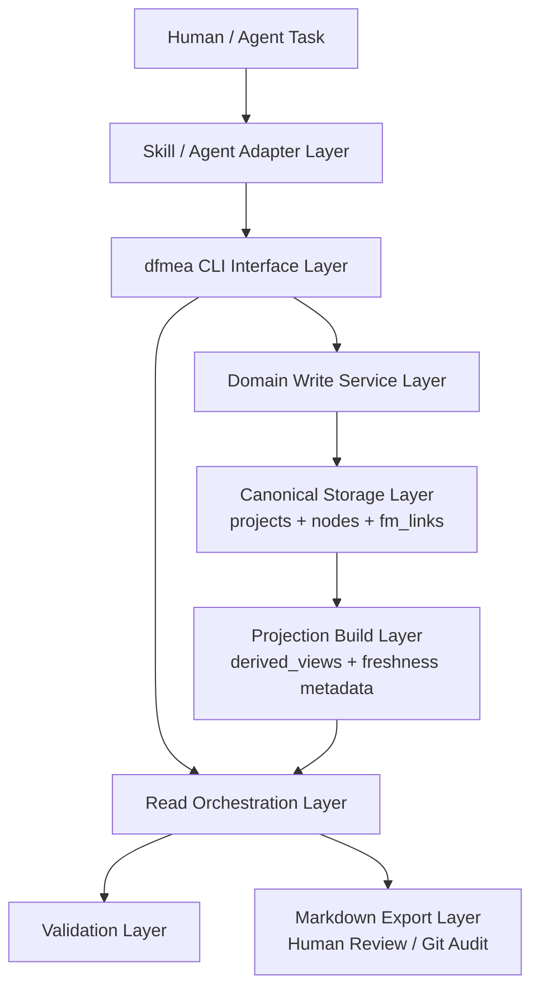

# DFMEA CLI-First 架构文档

> 上位文档：`docs/requirements/2026-03-15-dfmea-skill-requirements.md`
>
> 文档状态：V1 架构基线（修订：CLI-first + projection-driven read model）
>
> 说明：本文档只定义架构，不包含实施排期、任务拆分或上线步骤。

> 实现状态更新（2026-03-28）：projection/read-model 主干已落地到当前仓库，包括 `derived_views`、`dfmea projection status/rebuild`、projection-backed `query summary/by-ap/by-severity/actions/map/bundle/dossier`、`--layout review` 导出，以及 `projection` 范畴的基础校验。本文档中的 projection 架构不再只是计划态，而是当前代码基线的一部分；但其中部分统计语义与 payload 严格校验仍在持续收口。

---

## 1. 架构目标与边界

本架构用于支持一个可供任意 Agent 使用的 DFMEA skill 包。V1 继续采用本地 SQLite 数据库作为唯一事实来源，继续通过 Markdown 导出提供人类可读视图和 Git 审计能力；对外的正式产品边界仍然是本地 `dfmea` CLI。在此基础上，V1 增补一个正式的 projection-driven read model 层，用于承载摘要、导航、横切查询和审阅导出所依赖的派生读模型。Skill 仍然存在，但其职责从“直接操作存储”收敛为“理解任务并路由到 CLI 命令”。

本文档重点回答以下问题：

- DFMEA 在 V1 中的官方可移植接口是什么
- SQLite、CLI、Skill、Markdown 在系统中分别承担什么职责
- projection 读模型层在不改变真相源的前提下承担什么职责
- Function、Requirement、Characteristic、FM、FE、FC、ACT 之间如何建立稳定关系
- 标准写操作、查询、校验、导出应遵守什么 CLI 契约
- 读 SQL 诊断能力保留到什么边界，以及为什么它不是正式可移植写接口

本文档不覆盖：

- 具体开发任务拆解
- 代码实现排期
- UI 或服务端 API 设计
- Markdown 反向导入机制

---

## 2. 上位约束

本架构必须满足以下上位要求，并在必要处对边界做出更严格的 V1 收敛：

- 采用 AIAG VDA DFMEA 7 步法作为方法论基础
- V1 使用本地 SQLite 单文件数据库作为主存储，不引入服务端数据库
- V1 支持 10 人以下 AI Agent 并发读写，通过 SQLite WAL 模式实现
- SQLite 是唯一事实来源；Markdown 仅作为导出视图，用于人类审阅和 Git 审计
- `dfmea` CLI 是 V1 的官方可移植接口，也是唯一受支持的标准写接口
- projection 是派生读模型，不是第二事实来源；它必须可重建、可校验、可追溯
- 读 SQL 诊断能力保留，用于本地诊断和高级分析，但该路径是非可移植能力，不构成跨 Agent 的稳定产品契约
- Function 必须能承载功能描述、关联要求和关联特性，并追溯到完整失效分析链
- 跨层失效传播链必须支持递归追溯（根因链和最终后果链）
- 输出既要便于人类审阅，也要便于 Agent 继续消费；其中 `json` 是 V1 唯一保证稳定的机器契约

与需求基线的关系说明：需求文档保留了“SQLite 对 Agent 友好”的原则；本架构将其具体化为“允许只读 SQL 诊断”，同时将标准写路径统一收口到 CLI，以减少不同 Agent 自行拼装 SQL 带来的语义漂移。

---

## 3. 总体架构

系统采用“Agent 适配层 + CLI 接口层 + 领域写服务层 + canonical 存储层 + projection 构建层 + 读取/导出/校验层”的六层架构。



六层职责如下：

- Agent 适配层：解释用户意图，选择正确的 `dfmea` 命令，补齐调用上下文，并向用户解释结果
- CLI 接口层：解析参数、统一命令树、标准化错误、输出稳定 JSON 契约，是跨 Agent 的正式兼容边界
- 领域写服务层：承载事务、ID 分配、层级校验、删除清理、失效链维护和写入后的修订号推进
- canonical 存储层：使用 SQLite 持久化 `projects`、`nodes`、`fm_links`，作为唯一事实来源
- projection 构建层：从 canonical graph 生成可重建的读模型，如组件摘要、风险登记、action backlog、导航视图和 dossier 载荷
- 读取/导出/校验层：优先消费 projection，必要时回读 canonical；生成 Markdown 导出，执行 `schema` / `graph` / `integrity` / `projection` 校验，并向 CLI 返回可消费结果

关键边界：

- Skill 不直接写 SQLite，不把 Markdown 当源数据
- CLI 负责“可移植接口”，领域写服务负责“业务规则执行”，SQLite canonical 层负责“事实持久化”，projection 层负责“任务友好的派生读模型”
- projection 必须可删可重建，不得被当作第二事实源使用
- 直接 SQL 只允许出现在只读诊断或本地高级分析场景，不作为标准写路径，也不作为 Skill 的默认执行方式

---

## 4. 核心架构决策

| 决策 | 结论 | 原因 |
|------|------|------|
| 官方可移植写契约 | 本地 `dfmea` CLI | 任意能调用本地命令的 Agent 都可复用同一接口，减少 prompt/runtime 差异 |
| Skill 角色 | CLI 适配器，而非 SQL 执行器 | Skill 擅长路由与上下文理解，不应重复实现事务、删除或校验规则 |
| 主存储介质 | SQLite 单文件数据库（WAL 模式） | 支持并发读写、事务原子性、SQL 查询，零服务端部署 |
| SQL 使用边界 | 允许只读诊断，不允许作为标准写接口 | 保留本地可观察性，同时避免多 Agent 自行写 SQL 造成规则漂移 |
| Markdown 角色 | 导出视图，非源数据 | 保留人类可读性和 Git 审计能力，但不成为事实来源 |
| Projection 角色 | 正式读模型层，服务摘要、导航、横切查询和 review 导出 | 吸收 PageIndex 式“先轻量导航再深入读取”的能力，但不改变真相层 |
| 领域服务层 | 所有标准写规则都集中在共享 service core | 统一事务、ID 分配、删除清理、引用校验和修订推进 |
| 并发模型 | SQLite WAL + busy timeout + 有界重试 | 满足 10 人以下 Agent 并发场景，并把锁争用失败标准化为 CLI 错误 |
| 项目隔离 | 一个 DFMEA 项目对应一个 SQLite 文件 | 便于独立迁移、备份和隔离；也简化 `--db` / `--project` 解析 |
| 输出契约 | 默认 JSON；`json` 是 V1 唯一稳定机器契约 | 便于不同 Agent 解析结果和串联后续命令 |
| 聚合单元 | Function 是分析层主聚合单元 | 承载功能描述、要求、特性及完整失效链 |
| Requirement/Characteristic 建模 | 作为 Function 的子记录，位于 `nodes` 表 | 保持结构化追溯，同时不额外扩张表设计 |
| canonical 数据库设计 | 3 张表：`projects` + `nodes` + `fm_links` | 保持极简真相层设计，单表继承 + 跨层溯源专用链接表 |
| 派生数据设计 | 同库增加 `derived_views` 表和 `projects.data` 中的 freshness 元数据 | 保持单文件部署，同时把读模型提升为正式能力 |
| ID 分配策略 | 事务内原子分配业务 ID，删除后不复用 | 满足唯一性和并发要求，避免外部计数漂移 |
| 业务 ID 范围 | 仅 SYS/SUB/COMP/FN/FM/ACT 有业务 ID；FE/FC/REQ/CHAR 无 | 减少 ID 管理成本，保持外部引用集中在需要公开追踪的对象 |
| 查询能力形态 | `dfmea query` / `dfmea trace` / `dfmea projection` 对外暴露，projection 与 SQL 在内部协同支撑 | 对 Agent 暴露稳定命令能力，同时减少高频读场景对 canonical 全量扫描的依赖 |
| 写后派生语义 | 写命令只更新 canonical 并标记 projection dirty，不在同一事务里同步重建派生读模型 | 降低写路径失败面，保证“事实已更新 / 投影待重建”状态清晰可恢复 |
| 删除策略 | 结构节点受控删除；分析节点 DB 级联 + 服务层补充清理 | 兼顾 SQLite 能力和 `ACT.target_causes` 等 JSON 内规则 |

---

## 5. 官方接口契约

### 5.1 正式边界

V1 中，`dfmea` 是 DFMEA 插件对外暴露的正式本地接口：

- 所有标准写操作必须经由 `dfmea` 执行
- 所有跨 Agent 复用能力应优先通过 `dfmea` 暴露
- Skill、脚本或其他适配器不得绕过 CLI 直接写 SQLite
- projection 相关能力必须经由 CLI 管理，不允许把 `derived_views` 当作手写维护的数据面
- 只读 SQL 可以存在，但仅限诊断、审计或本地高级分析；它不是稳定产品契约
- Markdown 导出永远是派生结果，不能反向作为源数据修改入口

### 5.2 命令树

V1 命令树定义如下：

```text
dfmea
  init
  projection
    status
    rebuild
  structure
    add
    update
    delete
    move
  analysis
    add-function
    update-function
    add-requirement
    update-requirement
    delete-requirement
    add-characteristic
    update-characteristic
    delete-characteristic
    add-failure-chain
    update-fm
    update-fe
    update-fc
    update-act
    link-fm-requirement
    unlink-fm-requirement
    link-fm-characteristic
    unlink-fm-characteristic
    link-trace
    unlink-trace
    update-action-status
    delete-node
  query
    get
    map
    search
    summary
    bundle
    dossier
    by-ap
    by-severity
    actions
    list
  trace
    causes
    effects
  validate
  export
    markdown
```

### 5.3 全局参数与解析规则

所有命令应支持一致的最小全局参数集合：

```text
--db <path>
--project <id>
--format <json|text|markdown>
--quiet
--busy-timeout-ms <n>
--retry <n>
```

全局规则：

- 若省略 `--format`，CLI 默认输出 `json`
- Agent 默认应优先使用 `--format json`
- `json` 是 V1 唯一保证稳定的机器契约；`text` / `markdown` 是面向人类的便利视图，可在小版本中调整
- 一个 DB 文件在 V1 中只承载一个 DFMEA 项目
- 若同时提供 `--db` 与 `--project`，CLI 必须验证两者匹配；不匹配时返回 `PROJECT_DB_MISMATCH`
- 若提供 `--db` 但省略 `--project`，CLI 应从 DB 自动解析唯一项目
- 若仅提供 `--project` 而未提供 `--db`，该解析策略不是 V1 必做要求

并发规则：

- CLI 应设置默认 SQLite busy timeout
- 写命令应对瞬时锁争用做有界重试
- 重试耗尽后必须返回结构化 `DB_BUSY` 错误，并给出重试提示

### 5.4 输出契约与退出语义

CLI 输出以稳定 JSON 为核心；若未显式提供 `--format`，默认输出 `json`。所有结果都应可被 Agent 继续消费。

成功结果至少包含：

- `contract_version`
- `ok`
- `command`
- `data`
- `warnings`
- `errors`
- `meta`

对于 projection-backed 的成功结果，`meta` 还应追加：

- `meta.projection.kind`
- `meta.projection.scope_ref`
- `meta.projection.canonical_revision`
- `meta.projection.status`（如 `fresh`、`rebuilt`）

失败结果至少包含：

- `contract_version`
- `ok = false`
- `command`
- `errors[]`（含 `code`、`message`、`target`、`suggested_action`）
- `meta`

校验结果追加规则：

- `validate` 必须始终返回完整问题列表，而不是遇到首个错误即提前中止
- 若不存在 `error` 级问题，则 `ok = true` 且进程退出码为 0
- 若存在一个或多个 `error` 级问题，则 `ok = false`、退出码非 0，且 `errors` 中必须包含 `VALIDATION_FAILED`，同时完整 `data.issues` 仍然返回
- 若只有 `warning` / `info` 问题，则 `ok = true`、退出码为 0

建议保留的错误码包括：

- `INVALID_PARENT`
- `NODE_NOT_EMPTY`
- `INVALID_REFERENCE`
- `DB_BUSY`
- `PROJECT_DB_MISMATCH`
- `VALIDATION_FAILED`

---

## 6. 逻辑数据模型

### 6.1 对象分类

V1 对象分为三类：有业务 ID 的节点、无业务 ID 的节点、派生视图。

| 类别 | 对象 | 业务 ID | 存储位置 | 说明 |
|------|------|---------|---------|------|
| 结构节点 | `SYS` / `SUB` / `COMP` | 有（全局唯一） | `nodes` 表 | 产品结构层级 |
| 功能节点 | `FN` | 有（全局唯一） | `nodes` 表 | 分析层主聚合单元 |
| 失效模式 | `FM` | 有（全局唯一） | `nodes` 表 | 失效分析链锚点，跨层溯源目标 |
| 措施 | `ACT` | 有（全局唯一） | `nodes` 表 | 有独立追踪需求（状态、负责人、截止日期） |
| 失效影响 | `FE` | 无业务 ID，仅有 DB rowid | `nodes` 表 | 依附于 FM；无独立业务 ID，但可在 CLI 中通过 `rowid` 外部寻址 |
| 失效原因 | `FC` | 无业务 ID，仅有 DB rowid | `nodes` 表 | 依附于 FM；无独立业务 ID，但可在 CLI 中通过 `rowid` 外部寻址 |
| 要求 | `REQ` | 无业务 ID，仅有 DB rowid | `nodes` 表 | Function 子信息；可在 CLI 中通过 `rowid` 外部寻址 |
| 特性 | `CHAR` | 无业务 ID，仅有 DB rowid | `nodes` 表 | Function 子信息；可在 CLI 中通过 `rowid` 外部寻址 |
| 跨层溯源链接 | — | 无 | `fm_links` 表 | FC/FE 到跨层 FM 的多对多关系 |
| 派生读模型 | `derived_views` 行 | 无业务 ID | `derived_views` 表 | 组件摘要、风险登记、action backlog、dossier 等正式读模型；可重建，不是事实源 |
| 导出视图 | Markdown 文件 | 不参与节点标识 | 文件系统 | 人类审阅用，可重新生成 |

### 6.2 ID 规则

业务 ID 采用以下正则：

```text
^(SYS|SUB|COMP|FN|FM|ACT)-\d{3,6}$
```

规则如下：

- 仅 `SYS`、`SUB`、`COMP`、`FN`、`FM`、`ACT` 分配业务 ID
- `FE`、`FC`、`REQ`、`CHAR` 不分配业务 ID，但保留 DB `rowid` 作为 CLI 可解析、可返回、可复用的外部寻址标识
- 业务 ID 通过领域服务层在事务内原子分配，并与写入动作放在同一逻辑提交边界内
- 删除不会回收 ID，允许出现跳号
- 项目节点 `PRJ` 的 ID 即为 `projects.id`，不在 `nodes` 表中

### 6.3 主归属关系矩阵

主归属关系通过 `nodes.parent_id` 列表达，只允许以下合法组合：

| 子对象 | 合法上级 | parent_id 指向 |
|--------|----------|---------------|
| `SYS` | `PRJ` | `0`（顶级哨兵值，通过 `project_id` 关联项目） |
| `SUB` | `SYS` | SYS 节点的 rowid |
| `COMP` | `SUB` | SUB 节点的 rowid |
| `FN` | `COMP` | COMP 节点的 rowid |
| `FM` | `FN` | FN 节点的 rowid |
| `FE` | `FM` | FM 节点的 rowid |
| `FC` | `FM` | FM 节点的 rowid |
| `ACT` | `FM` | FM 节点的 rowid |
| `REQ` | `FN` | FN 节点的 rowid |
| `CHAR` | `FN` | FN 节点的 rowid |

说明：

- `ACT` 在 V1 中主归属于 `FM`，而不是 `FC`
- `ACT` 通过 `data.target_causes` 关联同一 `FM` 内的一个或多个 `FC`（存储 `FC` 的 rowid 数组）
- `ACT` 的生命周期跟随其主归属 `FM`
- 主归属层级合法性由领域服务层校验，并通过 CLI 以结构化错误返回

### 6.4 受控引用关系

V1 的引用关系按存储方式分为两类：

#### 跨层溯源引用（`fm_links` 表）

| 发起对象 | 目标对象 | 关系 | 约束 |
|----------|----------|------|------|
| `FC` | `FM` | 原因溯源到其他组件中的失效模式 | 可选，0 到多个；V1 在当前合法结构模型下仅强制目标 FM 位于不同组件 |
| `FE` | `FM` | 影响传播到其他组件中的失效模式 | 可选，0 到多个；V1 在当前合法结构模型下仅强制目标 FM 位于不同组件 |

通过 `fm_links` 表实现多对多关系，支持递归查询。

#### 局部引用（`data` JSON 字段）

| 发起对象 | 字段 | 目标对象 | 约束 |
|----------|------|----------|------|
| `ACT` | `target_causes` | `FC[]` (rowid) | 至少 1 个；目标 FC 必须与该 ACT 位于同一 FM |
| `FM` | `violates_requirements` | `REQ[]` (rowid) | 可选；目标 REQ 必须位于同一 FN |
| `FM` | `related_characteristics` | `CHAR[]` (rowid) | 可选；目标 CHAR 必须位于同一 FN |

局部引用不参与递归查询，也不参与 JOIN，因此放在 JSON 中。

V1 不允许：

- 任意节点指向任意节点
- 跨项目引用
- `FM -> FE` 的反向自由引用
- 未声明语义的裸引用字段

### 6.5 跨层溯源设计（混合式策略）

在 AIAG VDA DFMEA 方法论中，失效影响（FE）通常对应其他组件中的更高层影响，失效原因（FC）通常对应其他组件中的更底层原因。理想状态下，这些关系可以表达为更细粒度的上下层组件方向语义。

V1 采用混合式策略处理这一关系：

- FE 和 FC 在 `data` JSON 中保留独立 `description` 快照，保证节点局部可读
- 通过 `fm_links` 表记录 FE/FC 到跨层 FM 的多对多溯源关系，支持 SQL JOIN 和递归遍历
- 由于 V1 当前正式支持的结构模型为 `SYS -> SUB -> COMP`，尚不能通过合法 CLI 数据表达 `COMP -> COMP` 的祖先/后代关系；因此 CLI 在 V1 中仅强制 trace 目标 FM 与源节点位于不同组件
- 校验层检查描述漂移；当 FE/FC 的 `description` 与溯源目标 FM 的 `description` 不一致时返回 `warning`
- V1 不要求双向自动同步，是否同步由用户或 Agent 在显式任务中决定

### 6.6 Function 内容模型

Function 是分析层主聚合单元，在逻辑上承载四类内容：

- 功能描述：该组件“做什么”
- 要求（REQ）：该功能必须满足的条件或规格
- 特性（CHAR）：要求的可测量或可检验表达
- 失效分析链：FM、FE、FC、ACT 及其关联关系

在 DB 中，Function 本身是一个 `nodes` 行，其子内容（REQ/CHAR/FM 及更深层对象）通过 `parent_id` 层级关联。

---

## 7. 存储架构

### 7.1 存储层定位

SQLite 仍然是唯一事实来源，但在 CLI-first 架构中，它属于正式可移植契约之后的内部实现层。

- 对 Agent：首选交互面是 `dfmea` CLI
- 对领域服务：SQLite 提供事务、索引、递归查询和 WAL 并发能力
- 对诊断场景：允许只读 SQL 检查和分析
- 对 V1 规范：禁止将“直接写 SQL”定义为官方使用模式

### 7.2 数据库 Schema

V1 的 canonical 数据模型仍然是 3 张表；为了支撑 projection-driven read model，在同一 SQLite 文件中增加 1 张可重建的派生表：

```sql
PRAGMA journal_mode = WAL;
PRAGMA foreign_keys = ON;
PRAGMA recursive_triggers = ON;

CREATE TABLE projects (
  id       TEXT PRIMARY KEY,
  name     TEXT NOT NULL,
  data     TEXT NOT NULL DEFAULT '{}',
  created  TEXT NOT NULL,
  updated  TEXT NOT NULL
);

CREATE TABLE nodes (
  rowid      INTEGER PRIMARY KEY AUTOINCREMENT,
  id         TEXT UNIQUE,
  type       TEXT NOT NULL,
  parent_id  INTEGER NOT NULL DEFAULT 0,
  project_id TEXT NOT NULL REFERENCES projects(id),
  name       TEXT,
  data       TEXT NOT NULL DEFAULT '{}',
  created    TEXT NOT NULL,
  updated    TEXT NOT NULL
);

CREATE TRIGGER trg_cascade_delete_node
AFTER DELETE ON nodes
BEGIN
  DELETE FROM nodes WHERE parent_id = OLD.rowid;
END;

CREATE TABLE fm_links (
  from_rowid  INTEGER NOT NULL REFERENCES nodes(rowid) ON DELETE CASCADE,
  to_fm_rowid INTEGER NOT NULL REFERENCES nodes(rowid) ON DELETE CASCADE,
  PRIMARY KEY (from_rowid, to_fm_rowid)
);

CREATE TABLE derived_views (
  project_id          TEXT NOT NULL REFERENCES projects(id) ON DELETE CASCADE,
  kind                TEXT NOT NULL,
  scope_ref           TEXT NOT NULL,
  canonical_revision  INTEGER NOT NULL,
  built_at            TEXT NOT NULL,
  data                TEXT NOT NULL,
  PRIMARY KEY (project_id, kind, scope_ref)
);

CREATE INDEX idx_node_type   ON nodes(type, project_id);
CREATE INDEX idx_node_parent ON nodes(parent_id);
CREATE INDEX idx_node_id     ON nodes(id) WHERE id IS NOT NULL;
CREATE INDEX idx_fm_links_to ON fm_links(to_fm_rowid);
CREATE INDEX idx_derived_views_kind ON derived_views(project_id, kind);
```

递归删除保证：

- 连接初始化必须显式启用 `PRAGMA recursive_triggers = ON`
- `trg_cascade_delete_node` 依赖该设置，才能在删除父节点后继续触发对子节点的递归删除
- 因此，架构保证的“删除 `FN` / `FM` 时递归清理其后代节点”不是隐含假设，而是连接级必备执行条件

### 7.3 `data` JSON 字段按类型约定

各节点类型的 `data` JSON 承载其特有属性：

```json
{
  "SYS/SUB/COMP": {"description": "电驱动系统"},
  "FN": {"description": "产生额定扭矩"},
  "REQ": {"text": "额定扭矩 >= 150Nm", "source": "design-spec"},
  "CHAR": {"text": "峰值扭矩", "value": "300", "unit": "Nm"},
  "FM": {
    "description": "扭矩输出不足",
    "severity": 7,
    "violates_requirements": [12, 15],
    "related_characteristics": [20]
  },
  "FE": {"description": "车辆加速性能下降", "level": "vehicle"},
  "FC": {"description": "绕组匝间短路", "occurrence": 4, "detection": 3, "ap": "High"},
  "ACT": {
    "description": "绝缘材料升级为 H 级",
    "kind": "prevention",
    "status": "planned",
    "owner": "李工",
    "due": "2026-06-01",
    "target_causes": [101, 105]
  }
}
```

### 7.4 ID 分配机制

业务 ID 在事务内原子分配。该机制仍然以 SQL 执行为底层手段，但其架构归属已经从“Agent 自行执行 SQL”切换为“领域服务层在 CLI 命令内部执行事务逻辑”。

```sql
BEGIN;
INSERT INTO nodes (id, type, parent_id, project_id, name, data, created, updated)
VALUES (
  'FM-' || printf('%03d',
    COALESCE((SELECT MAX(CAST(SUBSTR(id, 4) AS INT))
              FROM nodes WHERE type = 'FM' AND project_id = ?), 0) + 1),
  'FM', ?, ?, ?, ?, datetime('now'), datetime('now')
);
COMMIT;
```

事务保证：即使多个 Agent 同时创建 FM，最终也必须通过 CLI 触发的共享服务层进入 SQLite 序列化写入，不应让不同 Skill 或 Agent 各自维护独立计数逻辑。

### 7.5 源数据、派生投影与导出视图分离

| 类别 | 载体 | 说明 |
|------|------|------|
| canonical 源数据 | SQLite `.db` 文件中的 `projects` / `nodes` / `fm_links` | 唯一事实来源，所有标准写操作最终作用于此 |
| 派生读模型 | SQLite `.db` 文件中的 `derived_views` + `projects.data` freshness 元数据 | 可重建，用于摘要、导航、横切查询和 review 导出，不是事实源 |
| 导出视图 | Markdown 文件 | 按需生成，用于人类审阅和 Git 提交，可重新生成 |

设计原则：

- 标准写操作通过 CLI 进入 SQLite
- 写命令成功后只推进 canonical 修订号并标记 projection dirty，不在同一事务内同步重建 projection
- projection 必须可以通过 canonical graph 重新构建；其损坏或缺失不应破坏源数据正确性
- Markdown 导出是只读派生物，永远不会反向写入 DB
- `export markdown` 的默认兼容布局继续允许 ledger 风格单文件导出；`review` 布局可显式启用，用于 projection 驱动的审阅视图
- 导出可以是全量导出，也可以按组件或查询条件导出
- 导出文件中应包含源对象的业务 ID 或 rowid，以便追溯
- 对旧库的 projection 使用必须支持幂等升级/回填，避免把 `derived_views` 的缺失暴露为底层 SQLite 错误

---

## 8. 面向 CLI 的操作语义

### 8.1 总体原则

V1 的操作语义以 CLI 契约为中心定义，而不是以“Agent 如何拼接 SQL”定义。

- 标准写操作必须通过 `dfmea` 命令进入系统
- 命令模块应保持轻量，只做参数解析、调用服务和结果渲染
- 领域服务层负责事务边界、业务校验、删除清理和对象解析
- CLI 必须将领域异常转换为结构化 JSON 失败结果
- 任何可复用的 Agent 工作流都应建立在命令契约之上，而不是建立在原始 SQL 语句之上

### 8.2 事务与并发语义

所有标准写命令必须在 SQLite 事务内完成。一个 CLI 逻辑命令对应一个原子提交边界，要么全部成功，要么全部回滚。

```text
CLI command -> resolve project/node refs -> service transaction -> canonical DB write(s) -> bump revision + mark projection dirty -> commit or rollback
```

并发相关规则：

- 连接必须启用 WAL 和外键约束
- CLI 应设置默认 busy timeout
- 写命令应对瞬时锁冲突做有界重试
- 重试耗尽时，CLI 返回 `DB_BUSY`，而不是把原始 SQLite 文本错误直接暴露为非结构化失败

### 8.3 创建类命令语义

V1 的主要创建动作对应以下 CLI 能力：

- `dfmea init`：创建 DB、Schema 和 `projects` 记录
- `dfmea structure add`：创建 SYS/SUB/COMP 节点
- `dfmea analysis add-function`：创建 FN
- `dfmea analysis add-requirement` / `add-characteristic`：在 FN 下创建 REQ/CHAR
- `dfmea analysis add-failure-chain`：在一个事务中创建 FM、FE、FC、ACT 及其 `fm_links`

共同语义：

- 有业务 ID 的对象必须在同一事务内分配并写入
- `created` 和 `updated` 必须同步设置
- 所有引用与父子归属必须在服务层完成合法性校验
- 成功响应应返回足够的对象标识（如 `id`、`rowid`、`affected_objects`），以支撑后续 CLI 命令

### 8.4 更新类命令语义

更新按命令粒度执行：

- `dfmea structure update`：修改结构节点属性，不改变归属
- `dfmea structure move`：显式改变结构归属，是结构所有权变化的唯一正式命令
- `dfmea analysis update-function` / `update-requirement` / `update-characteristic`：修改 FN 或其子记录
- `dfmea analysis update-fm` / `update-fe` / `update-fc` / `update-act`：修改失效链节点
- `dfmea analysis update-action-status`：对常见措施状态流转提供便捷命令
- `dfmea analysis link-*` / `unlink-*`：维护 REQ/CHAR 和跨层 trace 链接

共同语义：

- 所有更新必须同步设置 `updated`
- 所有解析 `id|rowid` 的逻辑都应在共享解析层统一完成
- 领域服务层负责限制不合法字段组合和不合法归属迁移

### 8.5 删除类命令语义

删除遵守“受控删除”原则，对外分别表现为 `dfmea structure delete` 和 `dfmea analysis delete-node`。

- `SYS` / `SUB` / `COMP`：只允许在非空校验通过后删除；若仍有子节点，CLI 返回 `NODE_NOT_EMPTY`
- 删除 `FN`：递归删除其全部分析子节点，`fm_links` 同步清理
- 删除 `FM`：递归删除 FE、FC、ACT，`fm_links` 同步清理
- 删除 `FC`：除删除自身外，还必须从同一 FM 内所有 ACT 的 `target_causes` 中移除该 FC；若某 ACT 清理后失去全部 target causes，则删除该 ACT
- 删除 `FE`：同步清理 `fm_links`
- 删除 `ACT`：仅删除该 ACT 本身

注意：`ACT.target_causes` 位于 JSON 中，因此 `FC` 删除后的清理必须在领域服务层执行，不能只依赖 SQLite 触发器或外键级联。

### 8.6 Projection、校验与导出命令语义

- `dfmea projection status`：返回当前项目的 `canonical_revision`、`last_projection_revision`、`projection_dirty` 和最近构建时间
- `dfmea projection rebuild`：重建当前项目的正式 projection，并在成功后清除 dirty 标记
- `dfmea validate`：执行 `schema`、`graph`、`integrity`、`projection` 校验，并始终返回完整报告
- `dfmea export markdown`：生成 Markdown 派生视图，不改变源数据；默认保持兼容 ledger 布局，`--layout review` 可显式启用 projection 驱动导出

校验分类保持如下：

1. `schema`
   - ID 格式、类型范围、JSON 字段值、时间戳格式
2. `graph`
   - `parent_id` 合法性、层级合法性、`fm_links` 方向、REQ/CHAR 归属、`ACT.target_causes` 合法性、孤儿节点、描述漂移
3. `integrity`
   - 业务 ID 唯一性、重复 `fm_links`、序号重复等完整性问题
4. `projection`
   - 派生读模型缺失、过期、损坏、不可回源、schema version 不匹配等问题

### 8.7 SQL 诊断语义

只读 SQL 仍然是允许的，但必须明确归类为“诊断能力”，而不是“产品写契约”：

- 可用于本地排障、性能分析、手工审计和临时高级查询
- 可复用本文档中的 schema、索引和递归 SQL 设计理解系统内部行为
- 不应成为 Skill 默认执行路径
- 不应被文档表述成跨 Agent 的正式写接口

---

## 9. 查询架构

### 9.1 查询能力以 CLI 暴露

V1 的查询能力首先被定义为 CLI 子命令，而不是定义为“让 Agent 自行写查询 SQL”。

正式查询能力包括：

- `dfmea query get`
- `dfmea query map`
- `dfmea query search`
- `dfmea query summary`
- `dfmea query bundle`
- `dfmea query dossier`
- `dfmea query by-ap`
- `dfmea query by-severity`
- `dfmea query actions`
- `dfmea query list`
- `dfmea trace causes`
- `dfmea trace effects`

这种定义方式的意义在于：

- Agent 面向稳定命令能力编排任务
- 服务层保持统一解析、权限边界和错误语义
- 内部可以在 canonical SQL 与 projection 读模型之间演进，而不要求所有 Skill 跟着改写查询实现

### 9.2 projection 驱动查询

V1 在查询架构中引入正式 projection 层，用于减少高频读场景对 canonical 全量扫描的依赖。

查询策略按两类划分：

1. 继续直读 canonical 的命令
   - `dfmea query get`
   - `dfmea query list`
   - `dfmea query search`
   - `dfmea trace causes`
   - `dfmea trace effects`

2. 优先读取 projection 的命令
   - `dfmea query summary`
   - `dfmea query by-ap`
   - `dfmea query by-severity`
   - `dfmea query actions`
   - `dfmea query map`
   - `dfmea query bundle`
   - `dfmea query dossier`

V1 的正式 projection 至少包括：

- `project_map`
- `component_bundle`
- `function_dossier`
- `risk_register`
- `action_backlog`

兼容约束：

- 现有 `query summary` / `query by-ap` / `query by-severity` / `query actions` 的稳定 JSON `data` 形状应尽量保持不变
- projection 来源和 freshness 信息优先补充到 `meta.projection`
- 若 projection 缺失或过期，命令可先自动重建再返回，但必须在 `meta.projection.status` 中显式说明

当前实现状态：

- 已落地并由测试覆盖的 projection-backed 查询包括 `summary`、`by-ap`、`by-severity`、`actions`、`map`、`bundle`、`dossier`
- `summary` / `bundle` / `dossier` 当前既接受业务 ID，也接受 rowid 输入，然后统一解析为稳定业务 ID 后读取 projection
- projection 缺失、dirty、或修订号漂移时，查询路径会自动 rebuild，并通过 `meta.projection.status` 返回 `rebuilt`
- 当前仍未完全收口的点是：各 projection payload 的严格 shape 校验、以及极端并发下的 freshness race 证明

### 9.3 SQL 作为底层支撑而非对外契约

canonical 查询和递归追溯仍然由 SQL 支撑。下面的 SQL 片段描述的是内部实现能力和诊断能力，不是 Agent 的标准使用契约。

```sql
SELECT fm.rowid, fm.name, fm.data,
       fc.rowid AS fc_rowid, fc.data AS fc_data,
       act.rowid AS act_rowid, act.data AS act_data
FROM nodes fn
JOIN nodes fm  ON fm.parent_id = fn.rowid  AND fm.type = 'FM'
LEFT JOIN nodes fc  ON fc.parent_id = fm.rowid  AND fc.type = 'FC'
LEFT JOIN nodes act ON act.parent_id = fm.rowid AND act.type = 'ACT'
WHERE fn.parent_id = @comp_rowid AND fn.type = 'FN';

SELECT * FROM nodes
WHERE type = 'FC' AND project_id = ?
  AND json_extract(data, '$.ap') = 'High';

SELECT * FROM nodes
WHERE type = 'ACT' AND project_id = ?
  AND json_extract(data, '$.status') = 'planned';

SELECT * FROM nodes
WHERE type = 'FM' AND project_id = ?
  AND CAST(json_extract(data, '$.severity') AS INT) >= 8;
```

### 9.4 递归追溯能力

跨层失效传播链通过 `fm_links` 和 `WITH RECURSIVE` 支撑；对外则表现为 `dfmea trace causes` 与 `dfmea trace effects`。

```sql
WITH RECURSIVE cause_chain AS (
  SELECT rowid, name, type, data, 0 AS depth
  FROM nodes WHERE rowid = @start_fm

  UNION ALL

  SELECT fm.rowid, fm.name, fm.type, fm.data, cc.depth + 1
  FROM cause_chain cc
  JOIN nodes fc ON fc.parent_id = cc.rowid AND fc.type = 'FC'
  JOIN fm_links lk ON lk.from_rowid = fc.rowid
  JOIN nodes fm ON fm.rowid = lk.to_fm_rowid
  WHERE cc.depth < 10
)
SELECT * FROM cause_chain;
```

对外契约要求：

- CLI 应返回可继续追踪的对象标识与深度信息
- 默认深度可配置，并应有上限保护
- SQL 可继续演进，但 `trace` 命令的稳定 JSON 结果语义不应随内部 SQL 调整而破坏

### 9.5 查询、校验与导出输出要求

查询输出至少包含：

- `rowid`
- `id`（如有）
- `type`
- `name` 或 `description`
- `parent_id` 或足够的归属上下文

对于 projection-backed 查询，额外要求：

- 返回项仍能追溯到业务 ID 或 rowid
- 若命令使用了 projection，应在 `meta.projection` 中说明来源、作用域、freshness 和构建修订号

当前实现说明：

- 这些要求已经在现有 `query` 命令成功结果中落地
- `meta.projection` 当前至少包含 `kind`、`scope_ref`、`canonical_revision`、`status`
- 相关契约已通过 CLI 测试覆盖，但 payload 的“字段级 schema 保证”仍在持续补强

校验输出至少包含：

- `level`
- `kind`
- `target`
- `reason`
- `suggested_action`

若为 projection 问题，还应能标识：

- `scope = projection`
- `kind` / `scope_ref`（若适用）
- 受影响的 `kind`
- 受影响的 `scope_ref`

导出结果必须满足：

- 结果是派生视图，不覆盖源数据
- 记录可追溯到业务 ID 或 rowid
- 即使按表格导出，也应能映射回源对象
- `review` 布局应优先消费 projection，而不是重复拼装另一套读模型逻辑

当前实现说明：

- `export markdown --layout review` 已落地，当前可生成 `index.md`、`components/*.md`、`functions/*.md`、`actions/open.md`
- review 导出已具备基础导航、traceable id/rowid、open actions 页面和 function dossier 页面
- 但 review 页面中的部分统计口径仍应视为“轻量摘要”，不是最终审计级风险报表

## 11. 当前实现状态与剩余风险

截至 2026-03-28，projection/read-model 相关能力的实现状态如下：

- 已实现
  - `derived_views` schema 与 projection metadata
  - `projection status` / `projection rebuild`
  - 写后 `canonical_revision` 推进与 `projection_dirty` 标记
  - projection-backed `query summary/by-ap/by-severity/actions/map/bundle/dossier`
  - `--layout review` 导出
  - `projection` 范畴的 `stale/missing/corrupt/untraceable/schema mismatch/metadata invalid` 校验

- 已修复的关键问题
  - projection auto rebuild 的 SQLite 连接泄漏
  - projection-backed 查询对 rowid 输入的回归
  - `query actions` 对 ACT 原始 `data` 的保真回归
  - `project_map` 空导航实现

- 仍在持续收口
  - projection payload 的严格 shape 校验
  - review 导出统计口径的严格语义
  - 极端并发场景下 projection freshness 的更强证明

---

## 10. Skill 包架构

### 10.1 包结构

```text
dfmea/
  SKILL.md
  node-schema.md
  storage-spec.md
  skills/
    dfmea-init/
      SKILL.md
    dfmea-structure/
      SKILL.md
    dfmea-analysis/
      SKILL.md
    dfmea-query/
      SKILL.md
    dfmea-maintenance/
      SKILL.md
```

### 10.2 角色分工

- `dfmea/SKILL.md`：主入口、术语解释、范围边界、CLI 路由总则
- `dfmea-init`：把初始化任务路由到 `dfmea init`
- `dfmea-structure`：把结构维护任务路由到 `dfmea structure *`
- `dfmea-analysis`：把 Function、REQ、CHAR、失效链维护路由到 `dfmea analysis *`
- `dfmea-query`：把查询、搜索、导航、递归追溯路由到 `dfmea query *` 和 `dfmea trace *`
- `dfmea-maintenance`：把 projection 管理、校验和导出路由到 `dfmea projection *`、`dfmea validate` 与 `dfmea export markdown`

### 10.3 子 skill 交接契约

为防止不同 Skill 对上下文理解不一致，定义以下交接约束：

- 进入结构维护前，必须已定位目标项目和目标结构父级，再调用 CLI
- 进入分析维护前，必须已定位目标 `COMP`；若作用于既有 Function，则还必须定位目标 `FN`
- 进入查询前，必须已确认目标 DB 路径、目标项目和输出格式偏好
- 进入维护前，必须明确当前操作是“projection 状态检查 / projection 重建 / 校验 / 导出”中的哪一种

### 10.4 Skill 边界约束

所有 Skill 必须共享本文档定义的：

- CLI 是正式写契约
- 数据源仍然是 SQLite，但 Skill 不直接写 DB
- projection 是正式读模型层，但 Skill 不直接维护 `derived_views`
- Markdown 是导出物，不是可编辑源数据
- ID 规则、主归属矩阵、引用关系、删除语义和校验语义由共享服务层统一执行

对 Skill 的额外限制：

- 不得把 SQL 写操作包装成默认工作流
- 不得在 Skill 内重写删除、校验或事务规则
- 若因诊断需要执行 SQL，必须限定为只读，且应明确说明该路径不具备跨 Agent 可移植性

---

## 11. 需求对齐矩阵

| 需求关注点 | 架构响应 |
|-----------|----------|
| Agent 可执行性与跨 Agent 一致性 | 通过本地 `dfmea` CLI 暴露统一命令树和稳定 JSON，Skill 作为适配器保证不同 Agent 使用同一执行边界 |
| Function 需要承载要求和特性 | REQ/CHAR 作为 FN 的子记录，通过 `parent_id` 关联 |
| 多人并发操作 | SQLite WAL + busy timeout + bounded retry；标准写操作统一收口到 CLI 服务层 |
| 源数据与导出视图分离 | SQLite = 源数据；Markdown = 导出视图 |
| 大规模分析层管理 | canonical SQL 支撑精确查询与递归追溯，projection 读模型支撑高频摘要、导航和横切读取，避免常见任务依赖全量扫描 |
| 输出需可追溯、可被 Agent 消费 | JSON 结果包含业务 ID、rowid、对象类型、错误码和建议动作 |
| 异常结果需清晰返回 | 通过结构化错误码和稳定 failure envelope 返回，如 `NODE_NOT_EMPTY`、`DB_BUSY`、`PROJECT_DB_MISMATCH` |
| 引用关系需受控 | 主归属走 `parent_id`，跨层溯源走 `fm_links`，局部引用走 `data` JSON |
| 跨层失效传播需可递归追溯 | `dfmea trace` 对外暴露，内部由 `fm_links` + `WITH RECURSIVE` SQL 支撑 |
| 删除必须受控 | 结构删除受控；分析删除由 DB 级联 + 服务层补充清理 |
| 数据可恢复 | SQLite 事务原子性 + WAL 恢复 + projection 可重建 + Markdown 可重建 |
| SQLite 对 Agent 友好 | 保留只读 SQL 诊断能力，但正式可移植写接口统一为 CLI |

---

## 12. V1 延后事项

以下内容刻意不在 V1 架构内实现：

- 直接 agent-authored SQL 作为官方写接口
- Markdown 反向导入
- 服务端 API
- 图形化编辑器
- 跨项目引用
- 复杂权限控制和审批流
- 全文搜索索引（FTS5）
- 交互式 REPL 或 shell（可作为 V2 增强）

---

## 13. 文档使用说明

从现在开始：

- `docs/requirements/2026-03-15-dfmea-skill-requirements.md` 作为需求基线
- `docs/architecture/2026-03-16-dfmea-skill-architecture.md` 作为正式 CLI-first 架构基线
- 任何关于标准写路径、Skill 边界、输出契约的讨论，均应以本文档为准
- 旧的 `implementation_plan.md` 仅保留为历史草案，不应继续作为正式架构依据
