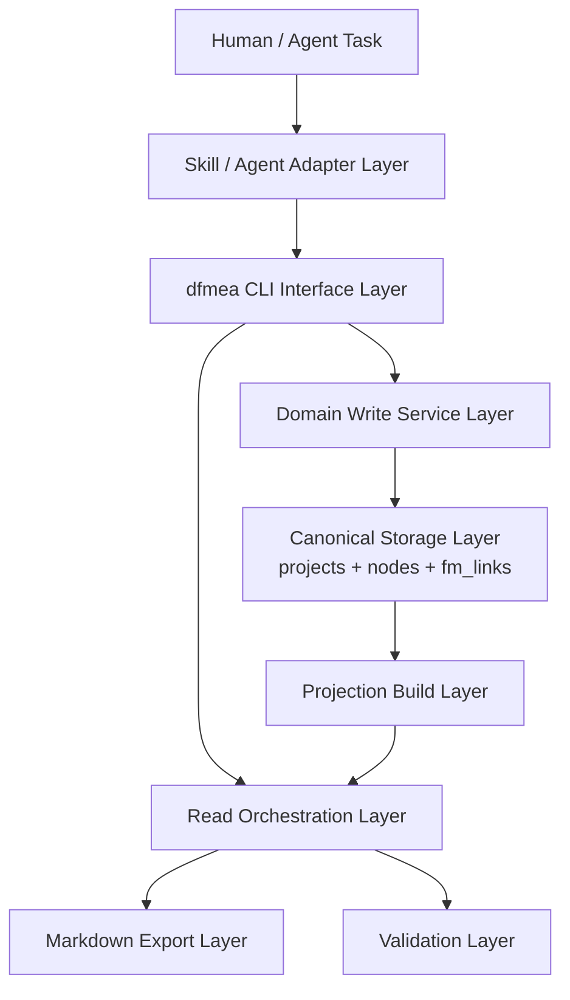

# DFMEA 投影驱动读模型增强设计

## 1. 文档定位

- 上位约束：`docs/requirements/2026-03-15-dfmea-skill-requirements.md`
- 现行正式架构：`docs/architecture/2026-03-16-dfmea-skill-architecture.md`
- 现有实现基线：`src/dfmea_cli/**/*.py`、`tests/**/*.py`
- 本文目标：在不破坏 `SQLite + CLI-first + Markdown 导出 + 强一致写入` 的前提下，引入一个正式的投影驱动读模型层，提升多 agent、大规模数据、审阅导出场景下的可用性。

本文不是对现有架构的推翻，而是对读侧能力的增强设计。

## 1.1 落地状态说明

截至 2026-03-28，本文描述的中度重构路线已在当前仓库中部分完成，且已经不再只是设计草案：

- `derived_views`、projection metadata、`projection status/rebuild` 已落地
- projection-backed 查询已覆盖 `summary/by-ap/by-severity/actions/map/bundle/dossier`
- `--layout review` 导出已落地，并能生成 index/component/function/actions 四类 review 页面
- `projection` 范畴的 validate 已落地到基础可用水平

因此，本文后续章节中的“建议”有两种状态：

- 已成为现有代码基线的一部分
- 仍作为后续强化项保留

## 2. 为什么要做这次增强

当前仓库已经具备清晰的 CLI-first 基线：

- `src/dfmea_cli/schema.py` 定义了 `projects`、`nodes`、`fm_links` 三张 canonical 表
- `src/dfmea_cli/services/structure.py`、`src/dfmea_cli/services/analysis.py` 承担标准写规则
- `src/dfmea_cli/services/query.py`、`src/dfmea_cli/services/trace.py`、`src/dfmea_cli/services/export_markdown.py`、`src/dfmea_cli/services/validate.py` 提供读、追溯、导出、校验能力

但当前实现仍然偏“真相层直出”：

- `query summary` 通过临时拼装统计数据完成组件摘要
- `query by-ap` / `query by-severity` / `query actions` 仍依赖 canonical 节点直接扫描和过滤
- `export markdown` 直接把底层节点账本渲染成一个单文件导出
- agent 缺少一个统一、轻量、可导航、可回源的读模型层

这意味着系统已经能“写对”，但还没有完全做到“让任意 agent 稳定看懂、快速定位、逐层深入”。

## 3. 从 PageIndex 借鉴什么，不借鉴什么

### 3.1 借鉴点

`VectifyAI/PageIndex` 对本项目最有价值的不是 RAG 本身，而是以下设计思想：

1. 先生成任务友好的中间表示，再按稳定身份深入原始内容
2. 轻量表示和完整表示分离
3. 用自然聚合单元组织信息，而不是机械切片
4. 让派生表示成为一等公民，而不是顺手拼接出来的临时视图
5. 让导出、导航、查询尽可能共用一套读模型

### 3.2 不借鉴点

以下做法不应进入 DFMEA canonical 写路径：

1. LLM 主导的结构推断和修复
2. best-effort 的事实写入
3. 用树状 JSON 取代 SQLite 作为主存储
4. 用自由推理文本替代可校验的引用关系和结构化约束

结论：PageIndex 的核心启发应落在“派生表示层”而不是真相层。

## 4. 设计目标

本增强设计必须同时满足以下目标：

1. 保持 SQLite 作为唯一事实来源
2. 保持 CLI 作为唯一标准写接口
3. 保持 `Function` 作为分析层主聚合单元
4. 避免常见 agent 任务依赖全量 canonical 扫描
5. 让查询、审阅、导出共用一套可重建读模型
6. 保证每个投影对象都能回源到 `id` 或 `rowid`
7. 保证多 agent 并发下，投影层损坏或过期不会污染 canonical 数据

## 5. 非目标

本次增强不做以下事情：

1. 不引入服务端数据库、API 或云索引服务
2. 不让 Markdown 反向成为写入口
3. 不引入 FTS5 作为 V1 必选能力
4. 不重写 canonical 数据模型为事件溯源或日志驱动架构
5. 不让 trace 结果依赖 LLM 推理

## 6. 关键术语

- `canonical graph`：`projects`、`nodes`、`fm_links` 组成的唯一事实层
- `projection`：从 canonical graph 生成的、可重建的派生读模型
- `dossier`：围绕一个业务聚合单元组织的审阅视图，例如 `Function dossier`
- `bundle`：围绕一个组件组织的聚合视图，例如 `Component bundle`
- `freshness`：投影是否与当前 canonical 修订号一致
- `traceability`：投影中的任何节点、卡片、摘要项都能映射回真实源对象

## 7. 总体方案

### 7.1 新的六层架构



### 7.2 分层职责

- `Domain Write Service Layer`
  - 负责事务、ID 分配、删除清理、引用合法性、状态流转
  - 写入成功后只更新 canonical graph 和投影新鲜度元数据

- `Canonical Storage Layer`
  - 继续承载唯一事实源
  - 不为了导出或 agent 上下文便利而改变建模原则

- `Projection Build Layer`
  - 新增的一等能力
  - 负责把 canonical graph 构造成任务友好的读模型
  - 负责 freshness、traceability、build schema version 管理

- `Read Orchestration Layer`
  - 优先读取 projection
  - 对仍需绝对精确/递归 SQL 的能力，直接读取 canonical graph

- `Markdown Export Layer`
  - 不再直接拼接账本式节点列表
  - 改为由 projection 驱动生成审阅友好的导出

- `Validation Layer`
  - 在原有 `schema` / `graph` / `integrity` 基础上，新增 `projection` 范畴

## 8. 核心设计决策

| 主题 | 决策 | 理由 |
|------|------|------|
| 真相层 | 保持 `projects` + `nodes` + `fm_links` 作为 canonical source | 不破坏现有 DFMEA 语义和事务模型 |
| 派生层载体 | 在同一 SQLite 文件中增加 `derived_views` 派生表 | 保持单文件部署，减少文件一致性问题 |
| 投影元数据 | 放入 `projects.data` | 避免再引入额外 meta 表 |
| 构建方式 | 显式 `projection rebuild` + 必要时按需自动重建 | 兼顾可控性与可用性 |
| 查询策略 | 读模型优先，trace/get 仍可直读 canonical | 兼顾性能、可解释性和准确性 |
| 导出策略 | Markdown 导出由 projection 驱动 | 让导出、人类审阅、agent 阅读共用读模型 |
| 校验策略 | `validate` 扩展到 `projection` 范畴 | 避免“源数据正确但派生视图失真” |

## 9. 数据设计

### 9.1 canonical 层保持不变

以下 canonical 事实层不做语义重构：

- `projects`
- `nodes`
- `fm_links`

`Function` 仍是分析层主聚合单元，`REQ/CHAR/FM/FE/FC/ACT` 的语义和归属关系保持不变。

### 9.2 新增派生表 `derived_views`

建议在 `src/dfmea_cli/schema.py` 中新增如下 DDL：

```sql
CREATE TABLE IF NOT EXISTS derived_views (
  project_id          TEXT NOT NULL REFERENCES projects(id) ON DELETE CASCADE,
  kind                TEXT NOT NULL,
  scope_ref           TEXT NOT NULL,
  canonical_revision  INTEGER NOT NULL,
  built_at            TEXT NOT NULL,
  data                TEXT NOT NULL,
  PRIMARY KEY (project_id, kind, scope_ref)
);

CREATE INDEX IF NOT EXISTS idx_derived_views_kind
  ON derived_views(project_id, kind);
```

约束解释：

- `kind`：投影种类，例如 `project_map`、`component_bundle`
- `scope_ref`：该投影绑定的对象，例如 `project`、`COMP-001`、`FN-001`
- `canonical_revision`：构建时所对应的 canonical 修订号
- `data`：该读模型的完整 JSON 载荷

### 9.3 `projects.data` 新增元数据约定

`projects.data` 中建议新增以下字段：

```json
{
  "canonical_revision": 12,
  "projection_dirty": true,
  "projection_schema_version": "1.0",
  "last_projection_build_at": "2026-03-25T10:30:00Z",
  "last_projection_revision": 11
}
```

语义如下：

- `canonical_revision`：每次成功写 canonical graph 后自增
- `projection_dirty`：存在投影需重建时为 `true`
- `projection_schema_version`：约束 `derived_views.data` 的形状版本
- `last_projection_build_at`：最近一次完整投影构建时间
- `last_projection_revision`：最近一次投影构建所对应的 canonical 修订号

### 9.4 升级与回填策略

当前仓库已经存在运行中的 `init`、`query`、`validate`、`export` 实现，因此必须定义旧库升级路径。

要求如下：

1. schema bootstrap 必须是幂等的，允许对旧库追加 `derived_views` 表
2. 任何读取 projection 的入口在首次发现旧库缺少 `derived_views` 或缺少 projection metadata 时，必须先执行轻量升级/回填
3. 回填最少应保证：
   - `derived_views` 表存在
   - `projects.data.canonical_revision` 存在，旧库默认从 `0` 开始
   - `projects.data.projection_dirty` 存在，旧库默认回填为 `true`
   - `projects.data.last_projection_revision` 存在，旧库默认回填为 `0`
4. 升级失败必须返回结构化错误，不能让命令以 `no such table: derived_views` 之类的底层异常形式泄漏出去

这意味着 projection 是“增量架构修订”，不是“只对新 init 生效的新世界”。

## 10. 正式读模型设计

本设计建议优先引入 4 类正式 projection。

### 10.1 `project_map`

- `kind = project_map`
- `scope_ref = project`
- 用途：作为整个项目的导航视图

建议结构：

```json
{
  "project": {"id": "demo", "name": "Demo"},
  "counts": {
    "systems": 1,
    "subsystems": 1,
    "components": 1,
    "functions": 2,
    "failure_modes": 6,
    "open_actions": 3
  },
  "structure": [
    {
      "id": "SYS-001",
      "rowid": 1,
      "type": "SYS",
      "name": "Drive",
      "children": []
    }
  ],
  "risk_summary": {
    "ap": {"High": 2, "Medium": 1, "Low": 3},
    "severity_gte_7": 2
  }
}
```

### 10.2 `component_bundle`

- `kind = component_bundle`
- `scope_ref = <COMP-id>`
- 用途：替代当前 `query summary` 的临时拼装输出，并提供组件级审阅入口

建议结构包含：

- 组件基础信息
- 祖先 breadcrumb（SYS/SUB/COMP）
- 该组件下的 Function 摘要列表
- 风险摘要（AP 分布、严重度分布、open actions）
- 最近更新动作/节点列表

### 10.3 `function_dossier`

- `kind = function_dossier`
- `scope_ref = <FN-id>`
- 用途：给 agent 和人类一个以 `Function` 为中心的完整工作视图

建议结构包含：

- Function 基础信息
- `REQ` 和 `CHAR` 列表
- 每个 `FM` 的 compact card
- 每个 `FM` 下 `FE/FC/ACT` 的精炼视图
- 指向 trace 的入口信息（如上下游 link 计数）

### 10.4 `risk_register`

- `kind = risk_register`
- `scope_ref = project`
- 用途：支撑 `query by-ap`、`query by-severity` 和风险横切视图

每条记录建议是一个扁平风险项：

```json
{
  "fm_id": "FM-001",
  "fm_rowid": 21,
  "component_id": "COMP-001",
  "function_id": "FN-003",
  "severity": 8,
  "ap": "High",
  "failure_mode": "Torque output too low",
  "top_action_statuses": ["planned", "in_progress"]
}
```

### 10.5 `action_backlog`

- `kind = action_backlog`
- `scope_ref = project`
- 用途：支撑 `query actions` 和导出中的待办措施总览

每条记录建议是一个扁平 action 项：

```json
{
  "act_id": "ACT-004",
  "act_rowid": 41,
  "status": "planned",
  "owner": "Chen",
  "due": "2026-06-15",
  "component_id": "COMP-001",
  "function_id": "FN-003",
  "fm_id": "FM-001",
  "target_cause_rowids": [35]
}
```

实现状态补充：

- `project_map`、`component_bundle`、`function_dossier`、`risk_register`、`action_backlog` 均已在代码中实现
- 其中 `project_map` 已支持真实结构树与基础风险摘要
- `action_backlog` 已带出 `owner/due` 及 `FM/FN/COMP` 上下文
- 仍未完全收口的是各 projection payload 的字段级 schema 约束与更严格的语义校验

## 11. 查询与命令设计

### 11.1 保持 canonical 直读的命令

以下命令继续直接读 canonical graph：

- `dfmea query get`
- `dfmea query list`
- `dfmea query search`
- `dfmea trace causes`
- `dfmea trace effects`

原因：

- `get` 是权威对象读取入口
- `list` 适合作为底层诊断/调试入口
- `search` 在 V1 可继续走简单 canonical 扫描
- `trace` 的递归性和 dangling-link 检查更适合直接依赖 `fm_links`

### 11.2 迁移到 projection 的命令

以下命令应改为优先读取 projection：

- `dfmea query summary` -> 基于 `component_bundle`
- `dfmea query by-ap` -> 基于 `risk_register`
- `dfmea query by-severity` -> 基于 `risk_register`
- `dfmea query actions` -> 基于 `action_backlog`
- `dfmea export markdown --layout review` -> 基于 `project_map` + `component_bundle` + `function_dossier`

重要兼容约束：

- 现有 `query summary` / `query by-ap` / `query by-severity` / `query actions` 的 JSON `data` 形状应尽量保持不变
- projection 相关信息优先补充到 `meta.projection`，而不是直接重写原有 `data` 结构
- `export markdown` 默认继续保持兼容的 ledger 导出，`review` 布局通过显式参数启用

### 11.3 新增命令

建议新增以下命令：

```text
dfmea
  projection
    status
    rebuild
  query
    map
    bundle
    dossier
```

定义如下：

- `dfmea projection status`
  - 返回 `projection_dirty`、`canonical_revision`、`last_projection_revision`
  - 让 agent 判断是否需要显式重建

- `dfmea projection rebuild`
  - 重建当前项目的全部正式 projection
  - 成功后清除 dirty 标记

- `dfmea query map`
  - 返回 `project_map`

- `dfmea query bundle --comp <COMP-id>`
  - 返回 `component_bundle`

- `dfmea query dossier --fn <FN-id>`
  - 返回 `function_dossier`

### 11.4 自动重建策略

建议采用混合式策略：

1. 所有标准写命令成功后：
   - 增加 `canonical_revision`
   - 将 `projection_dirty = true`

2. 对 projection-backed 命令：
   - 默认检测 freshness
   - 若 stale/missing，则先自动重建再读取
   - 在 `meta.projection.status` 中回报 `fresh`、`rebuilt` 或 `stale_allowed`

3. 对人工维护场景：
   - 允许显式运行 `dfmea projection rebuild`

实现状态补充：

- 当前代码已经实现自动重建
- 查询结果会通过 `meta.projection.status` 返回 `fresh` 或 `rebuilt`
- auto rebuild 的连接泄漏问题已在后续实现中修复
- 极端并发 freshness race 仍属于后续强化点

## 12. 导出设计

### 12.1 设计原则

导出不再以“节点账本”为主要目标，而应以“审阅可读、回源明确、局部 diff 友好”为目标。

### 12.2 建议导出布局

建议 `dfmea export markdown --out <dir>` 生成多文件导出：

```text
<out>/<project_id>/
  index.md
  components/
    COMP-001.md
  functions/
    FN-001.md
  actions/
    open.md
```

文件职责：

- `index.md`
  - 项目总览、结构树、风险摘要、组件入口
- `components/<COMP-id>.md`
  - 基于 `component_bundle`
- `functions/<FN-id>.md`
  - 基于 `function_dossier`
- `actions/open.md`
  - 基于 `action_backlog`

每个 Markdown 块都必须保留：

- `id`
- `rowid`（对无业务 ID 节点）
- 来源组件 / Function / FM 链接信息

### 12.3 兼容策略

为避免一次性打破现有导出使用方式，建议：

- 保留当前单文件 `ledger` 导出模式作为默认兼容选项
- 新增显式 `--layout review` 导出布局
- 仅在后续 contract 升级时，才考虑将 `review` 变成默认布局

## 13. 校验设计

### 13.1 新增 `projection` 校验范围

`dfmea validate` 在现有 `schema` / `graph` / `integrity` 外，增加 `projection` 问题类型。

### 13.2 建议问题类型

- `STALE_PROJECTION`（warning）
- `MISSING_PROJECTION`（warning 或 error，取决于命令要求）
- `PROJECTION_CORRUPT`（error）
- `PROJECTION_UNTRACEABLE`（error）
- `PROJECTION_SCHEMA_MISMATCH`（error）

### 13.3 校验规则

至少检查以下内容：

1. `derived_views.data` 是否是合法 JSON
2. `scope_ref` 是否对应真实对象
3. 所有投影里的 `id` / `rowid` 是否能回源到 canonical 节点
4. `canonical_revision` 是否匹配项目当前修订号
5. `projection_schema_version` 是否匹配当前运行时版本

实现状态补充：

- 当前已实现 `STALE_PROJECTION`、`MISSING_PROJECTION`、`PROJECTION_CORRUPT`、`PROJECTION_UNTRACEABLE`、`PROJECTION_SCHEMA_MISMATCH`、`PROJECTION_METADATA_INVALID`
- 当前已覆盖 metadata 形状错误、metadata revision 类型错误、孤儿 projection、单条 projection revision 漂移
- 尚未完全实现的是“按 projection kind 做字段级 payload schema 校验”

## 14. 并发与事务语义

### 14.1 写路径

canonical 写路径不变：

```text
CLI write command -> service transaction -> canonical graph update -> bump revision -> mark projection dirty -> commit
```

要求：

- 任何写命令不得同步写入局部 projection 以避免半更新
- 写路径结束时只留下“事实已更新、projection 待重建”的明确状态

### 14.2 投影重建路径

建议的重建流程：

```text
start read snapshot -> load canonical graph -> build projection payloads -> replace derived_views rows -> update project projection metadata -> commit
```

要求：

- projection build 必须是幂等的
- projection build 失败不得污染 canonical graph
- projection build 可以重试

## 15. 对现有实现的影响

### 15.1 必改模块

- `src/dfmea_cli/schema.py`
  - 增加 `derived_views` DDL

- `src/dfmea_cli/services/projects.py`
  - 初始化 `projects.data` 中的 projection 元数据

- `src/dfmea_cli/services/structure.py`
- `src/dfmea_cli/services/analysis.py`
  - 每次成功写入后 bump `canonical_revision` 并标记 dirty

- `src/dfmea_cli/services/query.py`
  - 将 `summary` / `by-ap` / `by-severity` / `actions` 改为 projection-backed
  - 新增 `map` / `bundle` / `dossier`

- `src/dfmea_cli/services/export_markdown.py`
  - 从 projection 驱动导出

- `src/dfmea_cli/services/validate.py`
  - 增加 projection 校验

- `src/dfmea_cli/cli.py`
- `src/dfmea_cli/commands/query.py`
- `src/dfmea_cli/commands/export_markdown.py`
- `src/dfmea_cli/commands/validate.py`
  - 暴露新命令和新输出元信息

### 15.2 建议新增模块

- `src/dfmea_cli/services/projections.py`
  - 统一封装 projection build、status、load、freshness 检查

- `src/dfmea_cli/commands/projection.py`
  - 暴露 `projection status`、`projection rebuild`

- `tests/test_projection_commands.py`
  - 覆盖 projection build/status 行为

### 15.3 必须同步修改的现有触点

以下现有模块必须同步调整，否则 projection 增强会与当前行为冲突：

- `src/dfmea_cli/services/projects.py`
  - `expected_tables` 逻辑要允许 `derived_views`
- `src/dfmea_cli/services/validate.py`
  - `REQUIRED_TABLES` 要纳入 `derived_views`
- `tests/test_bootstrap.py`
  - 根 help 需要覆盖新增 `projection` 命令组
- `tests/test_analysis_failure_chain_update.py`
  - 覆盖 update 类命令后的 dirty 行为
- `tests/test_analysis_links_and_delete.py`
  - 覆盖 link/unlink/delete 类命令后的 dirty 行为

## 16. 分阶段落地建议

### 阶段 1：投影基础设施

- `derived_views` 表
- `projects.data` freshness 元数据
- 旧库升级 / metadata 回填
- 写后 dirty 标记
- `projection status` / `projection rebuild`

### 阶段 2：读模型接管横切查询

- `component_bundle`
- `risk_register`
- `action_backlog`
- 接管 `query summary` / `by-ap` / `by-severity` / `actions`

### 阶段 3：引入 dossier 读模型

- `function_dossier`
- 新增 `query map` / `query bundle` / `query dossier`

### 阶段 4：Markdown 导出重构

- review 导出布局
- ledger 兼容模式

### 阶段 5：校验与文档收口

- `projection` 校验
- skill 路由文档更新
- 架构文档更新

## 17. 风险与对策

| 风险 | 说明 | 对策 |
|------|------|------|
| dirty 状态长期不清理 | 写多读少时，projection 长期过期 | 提供自动重建和显式 status/rebuild 命令 |
| projection 成为第二真相 | 开发者误把 `derived_views` 当业务事实层 | 文档和校验中明确 projection 可删可重建 |
| 导出结构变化过大 | 影响现有依赖单文件导出的工作流 | 保留 ledger 兼容模式 |
| 写路径复杂化 | 若把 projection build 混入写事务会增加失败面 | 严格禁止写命令同步构建 projection |
| 验证成本上升 | 新增 projection 校验会增加复杂度 | 将 freshness 警告与 corrupt 错误分层处理 |

## 18. 备选方案与否决理由

### 18.1 只保留当前 canonical 直查模式

否决原因：

- 能写对，但 agent 读侧效率和稳定性不足
- 导出与查询会继续各自拼装逻辑

### 18.2 用 Markdown 作为 projection 主载体

否决原因：

- 容易把导出视图误用为事实或准事实
- 查询不如 SQLite 内派生表稳定和高效

### 18.3 改成事件溯源 + 多 projector

否决原因：

- 对当前仓库阶段过于激进
- 实现与验证复杂度显著增加

## 19. 范围收敛建议

为了降低一次性交付风险，推荐分两期推进：

### 一期（推荐先做）

1. `derived_views` 表和 metadata 基础设施
2. 旧库升级 / 回填
3. `projection status` / `projection rebuild`
4. `query summary` / `by-ap` / `by-severity` / `actions` 改为 projection-backed，但保持现有对外 `data` 契约
5. `validate` 增加 projection 校验
6. `export markdown --layout review`，同时默认保留 `ledger`

### 二期（在一期稳定后）

1. `query map`
2. `query bundle`
3. `query dossier`
4. 更细粒度的 dossier 导出和导航体验优化

## 20. 最终结论

推荐采用“中度重构”路线：

1. 保留现有 canonical graph 和 CLI-first 写路径
2. 新增正式的 projection 层作为读模型中间层
3. 让横切查询、dossier 阅读和 Markdown 导出逐步迁移到 projection
4. 保持 trace 和权威对象读取仍能直连 canonical graph

这条路线吸收了 PageIndex 最有价值的部分：

- 任务友好的中间表示
- 轻量视图与完整视图分离
- 稳定身份驱动的逐层深入

同时没有把 PageIndex 在非结构化文档场景中的 best-effort 特性带入 DFMEA 真相层。

## 21. 当前已实现范围与后续强化项

### 已实现范围

- projection schema / metadata / legacy upgrade path
- projection 管理命令
- projection-backed 查询主路径
- review 导出主路径
- projection validate 基础规则

### 已验证范围

- CLI 测试已覆盖 init / projection / query / validate / export 的主要 happy path 与关键回归场景
- 当前完整测试集已达到 `122 passed`

### 后续强化项

- projection payload 的严格 schema/type 校验
- review 导出统计语义的进一步收紧
- 并发 freshness 的更强验证
