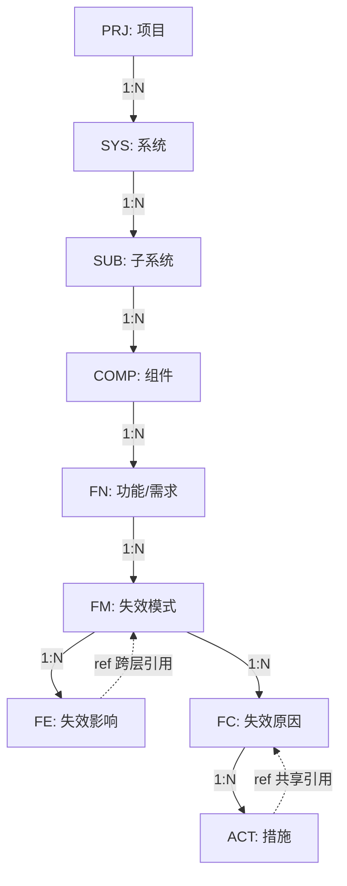
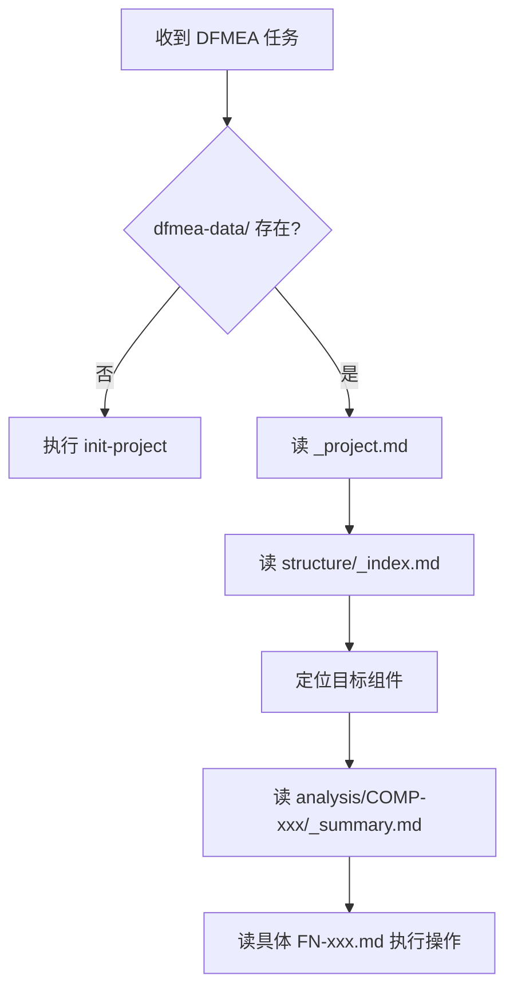
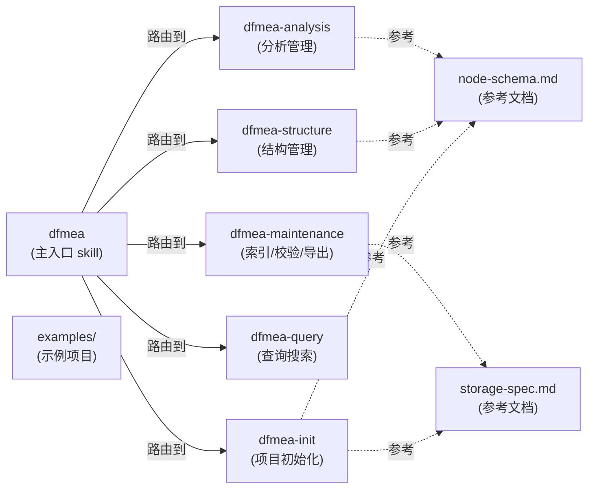
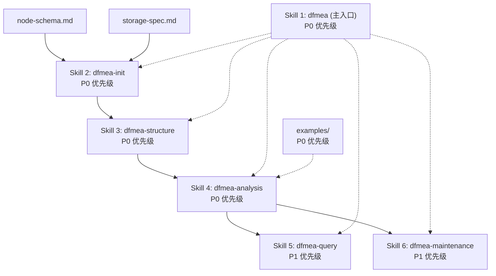

# DFMEA Skill 架构设计方案（审查完善版）

> 一个可供任意 Agent 使用的 DFMEA（设计失效模式与影响分析）skill，所有数据以 markdown 文件存储，支持大规模节点（10万+）的分层管理。

## 需求总结

| 维度 | 决策 |
|------|------|
| 方法论 | AIAG VDA DFMEA 7步法 |
| 节点规模 | 结构层 ≤100，分析层 10k-100k |
| 操作模式 | 聚焦式 / 横切查询 / 批量生成 |
| ID 方案 | 混合式（类型前缀 + 自增编号），格式 `^(PRJ\|SYS\|SUB\|COMP\|FN\|FM\|FE\|FC\|ACT)-\d{3,6}$` |
| 存储格式 | 分层多文件 markdown |
| 设计参考 | 借鉴 obra/superpowers 的设计思想（composable、agent-agnostic、self-describing） |

---

## 一、Skill 整体结构

借鉴 superpowers 的核心设计思想（可组合、agent 无关、自描述），但不强制遵循其目录规范。

```
dfmea/
  SKILL.md                      ← 主指令文件（agent 的操作手册）
  node-schema.md                ← 节点类型定义 & markdown 格式规范 
  storage-spec.md               ← 存储目录结构 & 索引规范
  examples/
    sample-project/             ← 一个最小完整示例项目
```

> [!IMPORTANT]
> SKILL.md 是入口点。Agent 读取 SKILL.md 后，按需引用 `node-schema.md` 和 `storage-spec.md`。

---

## 二、节点类型体系（AIAG VDA 7步法映射）

### 2.1 节点类型清单

| 类型前缀 | 名称 | 所属步骤 | 示例 ID | 说明 |
|----------|------|---------|---------|------|
| `PRJ` | Project | Step 1 规划 | `PRJ-001` | 项目（顶层，唯一） |
| `SYS` | System | Step 2 结构分析 | `SYS-001` | 系统元素 |
| `SUB` | Subsystem | Step 2 结构分析 | `SUB-003` | 子系统元素 |
| `COMP` | Component | Step 2 结构分析 | `COMP-012` | 组件元素 |
| `FN` | Function | Step 3 功能分析 | `FN-045` | 功能/需求/特性 |
| `FM` | Failure Mode | Step 4 失效分析 | `FM-128` | 失效模式 |
| `FE` | Failure Effect | Step 4 失效分析 | `FE-201` | 失效影响 |
| `FC` | Failure Cause | Step 4 失效分析 | `FC-301` | 失效原因 |
| `ACT` | Action | Step 5-6 优化 | `ACT-500` | 预防/探测措施 |

### 2.2 节点间关系



### 2.3 引用机制（N:M 关系）

**主归属**（实线）：每个节点有且仅有一个 `parent`，构成严格的树结构。

**引用关系**（虚线 refs）：节点可通过 `refs` 字段引用其他节点，支持 N:M 关系：
- FE 可以 ref 另一个 FM（表示失效影响向上传播）
- ACT 可以 ref 多个 FC（表示一个措施同时预防多个原因）
- FM 可以 ref 另一个 FE（跨组件的失效链接）

```yaml
# 示例：一个 ACT 同时预防两个失效原因
refs:
  - FC-301
  - FC-450
```

### 2.4 级联删除规则

| 删除对象 | 规则 | 说明 |
|---------|------|------|
| SYS/SUB/COMP | **禁止直接删除** | 必须先清空其下所有子节点 |
| FN | 级联删除所有 FM/FE/FC/ACT | 同时清理其他节点对它们的 refs |
| FM | 级联删除关联的 FE、FC（及 FC 下的 ACT） | |
| FC | 级联删除关联的 ACT | |
| FE / ACT | 直接删除 | 叶子节点，同时清理其他节点的 refs |

> [!WARNING]
> 删除任何节点后，agent 必须执行 `validate` 操作检查是否存在孤儿引用。

---

## 三、存储目录结构

### 3.1 总体布局

```
{project-root}/
  dfmea-data/
    {project-id}/                        ← 一个 DFMEA 项目
      _project.md                        ← 项目元数据 + 全局配置 + dirty 标志
      _counter.md                        ← ID 计数器状态（全局互斥资源）
      
      structure/                         ← 结构层（≤100 文件）
        _index.md                        ← 结构树索引（系统→子系统→组件的树形目录）
        SYS-001.md
        SUB-001.md
        COMP-001.md
        ...
      
      analysis/                          ← 分析层（按组件分目录）
        COMP-001/                        ← 组件 COMP-001 的所有分析
          _summary.md                    ← 该组件的分析摘要索引
          FN-001.md                      ← 功能节点 + 其下完整失效分析链
          FN-002.md
          ...
        COMP-002/
          _summary.md
          FN-003.md
          ...
      
      indexes/                           ← 派生索引（支持横切查询，可重建）
        ap-high.md                       ← AP=High 的失效汇总
        ap-medium.md
        ap-low.md
        by-severity.md                   ← 按严重度 S 分组
        actions-open.md                  ← 未关闭的措施清单
        actions-completed.md
        summary-stats.md                 ← 全局统计（节点数、AP 分布）
        recent-changes.md                ← 最近修改的节点
```

### 3.2 设计决策说明

| 决策 | 理由 |
|------|------|
| 结构层每个节点一个文件 | 结构节点 ≤100，文件数可控，每个文件体积小 |
| 分析层按 **组件→功能** 拆文件 | 功能是分析的自然聚合单元；一个功能下的 FM/FE/FC/ACT 链放在同一文件，agent 一次读取即可获得完整上下文 |
| 功能文件内 FM ≤50 | 超过此阈值必须按子分类拆分为多文件，拆分关系记录在 `_summary.md` 中 |
| indexes/ 是派生数据 | 可随时重建，通过 `_project.md` 中 `indexes_dirty` 标志控制懒更新 |

### 3.3 文件大小控制

- 每个功能文件（`FN-xxx.md`）内的 FM 数量 **硬性上限 50 个**
- 超过上限时：按功能子分类拆分为 `FN-001a.md` / `FN-001b.md`，在 `_summary.md` 中记录拆分映射
- 全局索引文件：约 1KB-10KB
- 结构节点文件：约 0.5KB-2KB

---

## 四、Markdown 文件格式规范

### 4.1 项目文件 `_project.md`

```markdown
---
id: PRJ-001
name: "电动汽车驱动系统 DFMEA"
version: "2.1"
schema_version: "1.0"
created: 2026-03-15
updated: 2026-03-15
owner: "张工"
status: draft
methodology: "AIAG-VDA-DFMEA"
indexes_dirty: false
related_projects: []
---

# PRJ-001: 电动汽车驱动系统 DFMEA

## 范围
本 DFMEA 覆盖电动汽车驱动系统的设计分析...

## 团队
| 角色 | 人员 |
|------|------|
| 负责人 | 张工 |
| 设计工程师 | 李工 |

## 系统引用
- [SYS-001](structure/SYS-001.md) - 驱动总成
- [SYS-002](structure/SYS-002.md) - 冷却系统
```

### 4.2 计数器文件 `_counter.md`

```markdown
---
PRJ: 1
SYS: 3
SUB: 12
COMP: 45
FN: 230
FM: 890
FE: 1200
FC: 1500
ACT: 2100
---
```

> [!CAUTION]
> `_counter.md` 是**全局互斥资源**。Agent 必须在**单次操作内**完成：读取 → 递增 → 写回。不得跨轮次持有未写回的计数。

### 4.3 结构节点文件（如 `COMP-001.md`）

```markdown
---
id: COMP-001
type: component
name: "电机定子绕组"
parent: SUB-002
created: 2026-03-15
updated: 2026-03-15
---

# COMP-001: 电机定子绕组

## 描述
负责产生旋转磁场，驱动转子旋转...

## 上级
- [SUB-002](SUB-002.md) - 电机子系统

## 关联功能
- [FN-045](../analysis/COMP-001/FN-045.md) - 产生额定扭矩
- [FN-046](../analysis/COMP-001/FN-046.md) - 绝缘保护
- [FN-047](../analysis/COMP-001/FN-047.md) - 散热传导
```

### 4.4 功能分析文件（核心文件，如 `FN-045.md`）

```markdown
---
id: FN-045
type: function
name: "产生额定扭矩"
component: COMP-001
created: 2026-03-15
updated: 2026-03-15
fm_count: 2
---

# FN-045: 产生额定扭矩

## 功能描述
电机定子绕组在额定工况下产生 150Nm 扭矩...

## 需求/特性
- 额定扭矩: 150Nm
- 峰值扭矩: 300Nm
- 效率: ≥96%

---

## 失效分析链

### FM-128: 扭矩输出不足

- **失效描述**: 实际输出扭矩低于额定值 >10%
- **严重度(S)**: 7

#### 失效影响

| ID | 影响描述 | 影响层级 | refs |
|----|---------|---------|------|
| FE-201 | 车辆加速性能下降 | 整车级 | |
| FE-202 | 爬坡能力不足 | 整车级 | FM-045 |

#### 失效原因 → 措施

| FC ID | 原因描述 | O | 预防措施 | 探测措施 | D | AP |
|-------|---------|---|---------|---------|---|-----|
| FC-301 | 绕组匝间短路 | 4 | ACT-500: 绝缘材料升级 | ACT-501: 匝间耐压测试 | 3 | Medium |
| FC-302 | 磁钢退磁 | 3 | ACT-502: 高温用磁钢选型 | ACT-503: 反电动势检测 | 4 | Low |

#### 措施详情

| ACT ID | 类型 | 描述 | 状态 | 负责人 | 截止日期 | refs |
|--------|------|------|------|--------|---------|------|
| ACT-500 | 预防 | 绝缘材料升级为 H 级 | planned | 李工 | 2026-06-01 | |
| ACT-501 | 探测 | 匝间耐压测试 2500V | in-progress | 王工 | 2026-05-15 | |
| ACT-502 | 预防 | 高温永磁材料选型 | completed | 李工 | 2026-04-01 | FC-302, FC-450 |

---

### FM-129: 扭矩波动过大

- **失效描述**: 扭矩纹波 >5%
- **严重度(S)**: 5

...（格式同上）
```

> **关键设计**: 一个功能文件包含该功能下**完整的失效分析链**（FM→FE→FC→ACT），每个 FM 是一个 `###` 级别的段落。ACT 增加了 `status`（planned/in-progress/completed/verified）和 `refs` 支持多 FC 共享。

### 4.5 索引文件（如 `indexes/ap-high.md`）

```markdown
---
type: index
scope: ap-rating
filter: High
rebuilt: 2026-03-15
---

# AP=High 失效汇总

| FM ID | 失效模式 | 组件 | 功能 | FC ID | S | O | D | AP | 源文件 |
|-------|---------|------|------|-------|---|---|---|----|--------|
| FM-128 | 扭矩输出不足 | COMP-001 | FN-045 | FC-301 | 7 | 4 | 3 | High | [link](../analysis/COMP-001/FN-045.md) |
```

---

## 五、Agent 操作手册

### 5.1 Agent 导航流程（首次接触项目时）



### 5.2 操作指令集

| 操作 | 触发场景 | Agent 详细步骤 |
|------|---------|---------------|
| **init-project** | 创建新项目 | ① 创建 `dfmea-data/{id}/` 及子目录 ② 创建 `_project.md`（填充元数据） ③ 创建 `_counter.md`（所有类型初始为 0） ④ 创建 `structure/_index.md`（空索引） ⑤ 建议执行 `git init` |
| **add-structure** | 添加系统/子系统/组件 | ① 读 `_counter.md` 获取+递增 ID ② 写回 `_counter.md` ③ 在 `structure/` 创建节点文件 ④ 更新 `structure/_index.md` ⑤ 更新父节点的子节点列表 ⑥ 如果是 COMP，创建 `analysis/{COMP-ID}/_summary.md` |
| **add-function** | 为组件添加功能 | ① 读+写 `_counter.md` ② 在 `analysis/{COMP-ID}/` 创建 `FN-xxx.md` ③ 更新 COMP 文件的关联功能列表 ④ 更新 `_summary.md` |
| **add-failure-chain** | 为功能添加失效链 | ① 读+写 `_counter.md`（批量获取 FM/FE/FC/ACT 的 ID） ② 在 `FN-xxx.md` 中追加 FM 段落 ③ 更新 frontmatter 的 `fm_count` ④ 设置 `_project.md` 的 `indexes_dirty: true` |
| **update-node** | 修改节点属性 | ① 定位文件和段落 ② 原地更新 ③ 更新 `updated` 日期 ④ 若修改 S/O/D/AP 值，设 `indexes_dirty: true` |
| **delete-node** | 删除节点 | ① 检查级联规则（见 2.4） ② 级联删除所有子节点 ③ 清理其他文件中的 refs ④ 更新 `_counter.md`~~（不减，保证 ID 不复用）~~ ⑤ 设 `indexes_dirty: true` ⑥ 执行 `validate` |
| **query-by-ap** | 按 AP 等级查询 | ① 检查 `indexes_dirty` ② 如 dirty → 先 `rebuild-indexes` ③ 读 `indexes/ap-{level}.md` |
| **query-by-component** | 组件概览 | 读 `analysis/{COMP-ID}/_summary.md` |
| **search-nodes** | 全文搜索 | grep 在 `dfmea-data/` 下搜索 |
| **rebuild-indexes** | 重建索引 | ① 遍历 `analysis/` 所有 FN 文件 ② 重新生成 `indexes/` 下所有文件 ③ 更新 `summary-stats.md` ④ 设 `indexes_dirty: false` |
| **validate** | 数据一致性校验 | ① 检查所有 parent 引用有效 ② 检查所有 refs 引用有效 ③ 检查 counter 与实际文件数一致 ④ 检查是否有孤儿文件 ⑤ 报告问题清单 |
| **export-table** | 导出为传统表格 | 从 md 文件汇总生成标准 FMEA 表格 |

### 5.3 操作一致性规则

1. **`_counter.md` 全局互斥**：读取→递增→写回必须在单次操作内完成。V1 假设**单 Agent 串行执行**，不引入复杂的文件锁机制。
2. **文本编码强约束（Critical）**：所有 Markdown 文件的读取和写入**必须是 STRICT UTF-8 (No BOM)**。在 Windows 环境下强制使用 `Set-Content -Encoding UTF8` (PowerShell) 或 Node.js 的 `utf8` 编码，坚决杜绝乱码。
3. **updated 日期同步**：每次修改节点必须更新 frontmatter 的 `updated`
4. **索引懒更新**：写操作设 `indexes_dirty: true`，查询索引前检查并按需重建
5. **ID 不复用**：删除节点后 counter 不减，确保 ID 全局唯一
6. **refs 清理**：删除节点时必须扫描并清理所有指向该 ID 的 refs

### 5.4 Common Mistakes（Agent 常见错误）

| 错误 | 后果 | 正确做法 |
|------|------|---------|
| 在 FN 文件中追加 FM 时忘记更新 `fm_count` | 索引和摘要数据不准 | 始终同步更新 frontmatter |
| 写完分析数据后忘记设 `indexes_dirty` | 查询返回过时数据 | 任何写操作后都设 dirty |
| 跨轮次持有 counter 未写回 | ID 冲突 | 单次操作内完成读写 |
| 删除 COMP 时未先清空分析 | 产生大量孤儿文件 | 先删除 analysis/ 下对应目录 |
| 直接修改索引文件 | 下次 rebuild 时丢失修改 | 索引是派生数据，只修改源文件 |
| **直接通过字符串替换或正则去修改复杂的 Markdown Table** | **表格格式极易崩溃，列对齐错乱** | **必须先完整解析 Table 为结构化数据（如 JSON 数组），修改后再重新生成格式化的 Markdown 表格覆盖原区域。** |
| 忘记指定文件写入编码 | 中文数据变成乱码 | 严格执行 UTF-8 (No BOM) 写入约束 |

---

## 六、横切查询策略

| 查询类型 | 实现方式 | 性能 |
|---------|---------|------|
| 按 AP 等级 | 读索引 `indexes/ap-{level}.md`（检查 dirty） | O(1) |
| 按严重度 S | 读索引 `indexes/by-severity.md` | O(1) |
| 按组件汇总 | 读 `analysis/{COMP-ID}/_summary.md` | O(1) |
| 未关闭措施 | 读索引 `indexes/actions-open.md` | O(1) |
| 全局统计 | 读 `indexes/summary-stats.md` 或 `_counter.md` | O(1) |
| 最近变更 | 读索引 `indexes/recent-changes.md` | O(1) |
| 全文关键词搜索 | grep 在 `dfmea-data/` 目录 | O(N) |

---

## 七、设计原则（借鉴 superpowers 思想）

| 原则 | 来源灵感 | 在本项目中的体现 |
|------|---------|----------------|
| **可组合** | superpowers skills 可独立使用和组合 | DFMEA skill 可被任意 agent 加载，不依赖特定框架 |
| **Agent 无关** | superpowers 通过纯 markdown 指令驱动 | 所有操作基于文件读写 + grep，不依赖特定 agent API |
| **自描述** | superpowers 的 skill 和 plan 都是人可读文档 | 每个 md 文件的 YAML frontmatter 包含完整元数据 |
| **约定优于配置** | superpowers 的固定目录和命名约定 | 目录结构、文件命名、frontmatter 字段都是固定约定 |
| **YAGNI** | superpowers 核心哲学 | 不做过度设计，索引按需重建，跨项目引用 V1 不实现 |
| **Design for Isolation** | superpowers 的单元隔离思想 | 每个文件可独立理解，通过 ID 引用关联 |

---

## 八、可扩展性预留

| 预留项 | 字段/机制 | 当前状态 |
|--------|----------|---------|
| Schema 版本 | `_project.md` → `schema_version: "1.0"` | 已定义，未来可做数据迁移 |
| 跨项目引用 | `_project.md` → `related_projects: []` | 已预留，V1 不实现 |
| 自定义节点类型 | 可通过 `_project.md` 扩展 | V1 不实现 |

---

## 九、Skills 分解方案

### 9.1 为什么要拆分为多个 Skill？

| 理由 | 说明 |
|------|------|
| **上下文节省** | Agent 上下文有限（通常 100k-200k token），加载一个巨大的 SKILL.md 浪费上下文 |
| **职责隔离** | 每个 skill 只做一件事，更容易测试和维护 |
| **按需加载** | Agent 只加载当前任务需要的 skill，不需要全部装入 |
| **可组合** | 不同任务组合不同的 skill，灵活应对各种场景 |

### 9.2 Skill 全景图



### 9.3 Skill 清单详解

---

#### Skill 1: `dfmea`（主入口）

| 项目 | 说明 |
|------|------|
| **文件** | `dfmea/SKILL.md` |
| **触发条件** | Agent 收到任何 DFMEA 相关任务 |
| **职责** | ① 识别任务类型 ② 引导 Agent 加载正确的子 skill ③ 提供全局概览 ④ 定义一致性规则和通用约定 |
| **不包含** | 具体的操作步骤（由子 skill 提供） |
| **预估大小** | ~200 行 |

**核心内容：**
- DFMEA 方法论概述（AIAG VDA 7步法）
-  Agent 导航流程图（见 5.1）
- 节点类型速查表（9种，ID 格式）
- 任务→子 skill 路由表
- 通用一致性规则（counter 互斥、updated 同步、indexes_dirty 等）
- Common Mistakes 速查

---

#### Skill 2: `dfmea-init`（项目初始化）

| 项目 | 说明 |
|------|------|
| **文件** | `dfmea/skills/dfmea-init/SKILL.md` |
| **触发条件** | 创建新 DFMEA 项目 / `dfmea-data/` 不存在 |
| **包含操作** | `init-project` |
| **依赖** | `node-schema.md`、`storage-spec.md` |
| **预估大小** | ~100 行 |

**核心内容：**
- `init-project` 的完整 step-by-step 指令
- 每个初始文件的模板（`_project.md`、`_counter.md`、`_index.md` 等）
- 目录创建的精确路径
- 初始化后的验证检查清单

---

#### Skill 3: `dfmea-structure`（结构管理）

| 项目 | 说明 |
|------|------|
| **文件** | `dfmea/skills/dfmea-structure/SKILL.md` |
| **触发条件** | 需要创建/修改/删除 SYS/SUB/COMP 节点 |
| **包含操作** | `add-structure`、`update-node`（结构层）、`delete-node`（结构层） |
| **依赖** | `node-schema.md` |
| **预估大小** | ~150 行 |

**核心内容：**
- SYS/SUB/COMP 三种节点的 CRUD 步骤
- 结构层节点的 markdown 模板（含 frontmatter）
- `structure/_index.md` 的维护规则
- 级联删除规则（结构节点禁止直接删除）
- 添加 COMP 时自动创建 `analysis/{COMP-ID}/` 目录

---

#### Skill 4: `dfmea-analysis`（分析管理）⭐ 最核心、最复杂

| 项目 | 说明 |
|------|------|
| **文件** | `dfmea/skills/dfmea-analysis/SKILL.md` |
| **触发条件** | 需要创建/修改/删除功能、失效模式、失效影响、失效原因、措施 |
| **包含操作** | `add-function`、`add-failure-chain`、`update-node`（分析层）、`delete-node`（分析层） |
| **依赖** | `node-schema.md` |
| **预估大小** | ~300 行 |

**核心内容：**
- FN/FM/FE/FC/ACT 五种节点的 CRUD 步骤
- FN 文件的完整 markdown 模板（含失效分析链格式）
- 失效链追加规则（如何在 FN 文件中新增 FM 段落）
- ACT 状态流转（planned → in-progress → completed → verified）
- refs 引用的创建和维护
- FN 文件拆分策略（FM > 50 时）
- `_summary.md` 的维护规则
- 批量生成场景的优化指引（一次性为组件生成完整分析）

---

#### Skill 5: `dfmea-query`（查询搜索）

| 项目 | 说明 |
|------|------|
| **文件** | `dfmea/skills/dfmea-query/SKILL.md` |
| **触发条件** | 需要查询/搜索/统计 DFMEA 数据 |
| **包含操作** | `query-by-ap`、`query-by-component`、`search-nodes` |
| **依赖** | `storage-spec.md` |
| **预估大小** | ~120 行 |

**核心内容：**
- 各查询类型的 step-by-step 操作
- 索引 dirty 检查 → 按需触发重建
- grep 搜索的推荐模式（按 ID 搜索、按关键词搜索、按 frontmatter 搜索）
- 查询结果格式化输出规范
- 复合查询的组合策略

---

#### Skill 6: `dfmea-maintenance`（索引/校验/导出）

| 项目 | 说明 |
|------|------|
| **文件** | `dfmea/skills/dfmea-maintenance/SKILL.md` |
| **触发条件** | 需要重建索引 / 校验数据一致性 / 导出标准表格 |
| **包含操作** | `rebuild-indexes`、`validate`、`export-table` |
| **依赖** | `storage-spec.md`、`node-schema.md` |
| **预估大小** | ~200 行 |

**核心内容：**
- `rebuild-indexes` 的遍历逻辑和每种索引的生成规则
- `validate` 的 5 项检查清单（parent/refs/counter/孤儿/格式）
- `export-table` 的标准 FMEA 表格格式
- `indexes_dirty` 标志的管理

---

#### 参考文档（非 Skill，供 Skill 引用）

| 文档 | 内容 | 预估大小 |
|------|------|---------|
| `node-schema.md` | 9 种节点类型的 YAML frontmatter 定义、markdown body 格式、refs 语法、级联删除规则 | ~250 行 |
| `storage-spec.md` | 目录结构完整规范、文件命名规则、索引文件格式、文件大小控制策略 | ~200 行 |

#### 示例项目

| 目录 | 内容 |
|------|------|
| `examples/sample-project/` | 一个最小完整 DFMEA 项目：1 PRJ + 1 SYS + 2 SUB + 3 COMP + 2 FN + 对应失效链 + 所有索引文件 |

### 9.4 最终文件结构

```
e:\study\dfmeaDemo\dfmea\
  dfmea/
    SKILL.md                                ← Skill 1: 主入口
    node-schema.md                          ← 参考文档
    storage-spec.md                         ← 参考文档

    skills/
      dfmea-init/
        SKILL.md                            ← Skill 2: 项目初始化
      dfmea-structure/
        SKILL.md                            ← Skill 3: 结构管理
      dfmea-analysis/
        SKILL.md                            ← Skill 4: 分析管理 ⭐
      dfmea-query/
        SKILL.md                            ← Skill 5: 查询搜索
      dfmea-maintenance/
        SKILL.md                            ← Skill 6: 索引/校验/导出

    examples/
      sample-project/                       ← 示例项目
        _project.md
        _counter.md
        structure/
          _index.md
          SYS-001.md
          SUB-001.md
          SUB-002.md
          COMP-001.md
          COMP-002.md
          COMP-003.md
        analysis/
          COMP-001/
            _summary.md
            FN-001.md
            FN-002.md
          COMP-002/
            _summary.md
            FN-003.md
        indexes/
          ap-high.md
          ap-medium.md
          ap-low.md
          by-severity.md
          actions-open.md
          summary-stats.md
```

### 9.5 依赖关系与实施优先级



### 9.6 实施路线图

| 阶段 | 内容 | 产出 | 预计工作量 |
|------|------|------|-----------|
| **Phase 1** | 参考文档 + 示例项目 | `node-schema.md` + `storage-spec.md` + `examples/` | 基础 |
| **Phase 2** | 核心 Skills | `dfmea`(主入口) + `dfmea-init` + `dfmea-structure` + `dfmea-analysis` | 主体 |
| **Phase 3** | 查询与维护 Skills | `dfmea-query` + `dfmea-maintenance` | 补全 |
| **Phase 4** | 集成验证 | 用 agent 端到端测试完整流程 | 验证 |

---

## Proposed Changes

### Phase 1：参考文档 & 示例

#### [NEW] [node-schema.md](file:///e:/study/dfmeaDemo/dfmea/dfmea/node-schema.md)
9 种节点类型定义（含 refs 引用、ACT 状态流转）、完整 markdown 格式示例、级联删除规则。

#### [NEW] [storage-spec.md](file:///e:/study/dfmeaDemo/dfmea/dfmea/storage-spec.md)
目录结构规范、索引懒更新策略、文件大小控制（FM ≤50/文件）、文件命名规则。

#### [NEW] [examples/](file:///e:/study/dfmeaDemo/dfmea/dfmea/examples/)
最小完整示例项目（1 PRJ + 1 SYS + 2 SUB + 3 COMP + 2 FN + 失效链 + 索引）。

### Phase 2：核心 Skills

> **Skill 文件编写规范（必须遵守 `writing-skills` 标准）**：每个新建的 `SKILL.md` 必须包含：
> 1. YAML frontmatter (`description`)
> 2. `## Context`（说明该 Skill 的用途）
> 3. `## Triggers`（触发该 Skill 的确切用户原话模式）
> 4. `## Workflows/Instructions`（核心逻辑和步骤）
> 5. `## Common Mistakes`（从 5.4 节摘录相关的防错建议）

#### [NEW] [SKILL.md](file:///e:/study/dfmeaDemo/dfmea/dfmea/SKILL.md)
主入口 skill，包含 YAML frontmatter、Triggers (任何 DFMEA 相关的意图)、Agent 导航流程、任务路由表、通用一致性规则。

#### [NEW] [dfmea-init/SKILL.md](file:///e:/study/dfmeaDemo/dfmea/dfmea/skills/dfmea-init/SKILL.md)
项目初始化 skill，包含 YAML frontmatter、Triggers ("初始化 DFMEA 项目")、`init-project` 的完整步骤和文件模板。

#### [NEW] [dfmea-structure/SKILL.md](file:///e:/study/dfmeaDemo/dfmea/dfmea/skills/dfmea-structure/SKILL.md)
结构管理 skill，包含 YAML frontmatter、Triggers ("添加系统/组件")、SYS/SUB/COMP 的 CRUD Workflow 步骤。

#### [NEW] [dfmea-analysis/SKILL.md](file:///e:/study/dfmeaDemo/dfmea/dfmea/skills/dfmea-analysis/SKILL.md)
分析管理 skill（最核心），包含 YAML frontmatter、Triggers ("添加功能/失效链")、FN/FM/FE/FC/ACT 的 CRUD 步骤（**需特别强调 Markdown 表格的防错修改方式**）。

### Phase 3：查询与维护 Skills

#### [NEW] [dfmea-query/SKILL.md](file:///e:/study/dfmeaDemo/dfmea/dfmea/skills/dfmea-query/SKILL.md)
查询搜索 skill，包含 YAML frontmatter、Triggers ("查询 AP/严重度/统计")、各类查询操作和 grep 搜索模式 Workflow。

#### [NEW] [dfmea-maintenance/SKILL.md](file:///e:/study/dfmeaDemo/dfmea/dfmea/skills/dfmea-maintenance/SKILL.md)
维护 skill，包含 YAML frontmatter、Triggers ("校验数据/重建索引/导出")、索引重建和数据校验的 Workflow。

---

## Verification Plan

### Manual Verification
1. 检查示例项目的 markdown 文件是否符合格式规范
2. 用任意 agent 加载 SKILL.md 后尝试 `init-project` → 验证目录和文件正确创建
3. 执行 `add-failure-chain` → 验证 counter 递增、frontmatter 更新、dirty 标志设置
4. 执行 `validate` → 验证能检测到人为制造的孤儿引用
5. 执行 `rebuild-indexes` → 验证索引文件与源数据一致
